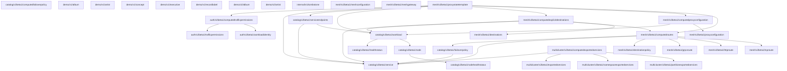

```mermaid
flowchart TD
  auth/v2beta1/computedtrafficpermissions --> auth/v2beta1/trafficpermissions
  auth/v2beta1/computedtrafficpermissions --> auth/v2beta1/workloadidentity
  catalog/v2beta1/computedfailoverpolicy
  catalog/v2beta1/failoverpolicy --> catalog/v2beta1/service
  catalog/v2beta1/healthstatus
  catalog/v2beta1/node --> catalog/v2beta1/nodehealthstatus
  catalog/v2beta1/nodehealthstatus
  catalog/v2beta1/service
  catalog/v2beta1/serviceendpoints --> catalog/v2beta1/service
  catalog/v2beta1/serviceendpoints --> catalog/v2beta1/workload
  catalog/v2beta1/workload --> catalog/v2beta1/healthstatus
  catalog/v2beta1/workload --> catalog/v2beta1/node
  demo/v1/album
  demo/v1/artist
  demo/v1/concept
  demo/v1/executive
  demo/v1/recordlabel
  demo/v2/album
  demo/v2/artist
  internal/v1/tombstone
  mesh/v2beta1/computedexplicitdestinations --> catalog/v2beta1/service
  mesh/v2beta1/computedexplicitdestinations --> catalog/v2beta1/workload
  mesh/v2beta1/computedexplicitdestinations --> mesh/v2beta1/computedroutes
  mesh/v2beta1/computedexplicitdestinations --> mesh/v2beta1/destinations
  mesh/v2beta1/computedproxyconfiguration --> catalog/v2beta1/workload
  mesh/v2beta1/computedproxyconfiguration --> mesh/v2beta1/proxyconfiguration
  mesh/v2beta1/computedroutes --> catalog/v2beta1/failoverpolicy
  mesh/v2beta1/computedroutes --> catalog/v2beta1/service
  mesh/v2beta1/computedroutes --> mesh/v2beta1/destinationpolicy
  mesh/v2beta1/computedroutes --> mesh/v2beta1/grpcroute
  mesh/v2beta1/computedroutes --> mesh/v2beta1/httproute
  mesh/v2beta1/computedroutes --> mesh/v2beta1/tcproute
  mesh/v2beta1/destinationpolicy
  mesh/v2beta1/destinations
  mesh/v2beta1/grpcroute
  mesh/v2beta1/httproute
  mesh/v2beta1/meshconfiguration
  mesh/v2beta1/meshgateway
  mesh/v2beta1/proxyconfiguration
  mesh/v2beta1/proxystatetemplate --> auth/v2beta1/computedtrafficpermissions
  mesh/v2beta1/proxystatetemplate --> catalog/v2beta1/service
  mesh/v2beta1/proxystatetemplate --> catalog/v2beta1/serviceendpoints
  mesh/v2beta1/proxystatetemplate --> catalog/v2beta1/workload
  mesh/v2beta1/proxystatetemplate --> mesh/v2beta1/computedexplicitdestinations
  mesh/v2beta1/proxystatetemplate --> mesh/v2beta1/computedproxyconfiguration
  mesh/v2beta1/proxystatetemplate --> mesh/v2beta1/computedroutes
  mesh/v2beta1/tcproute
  multicluster/v2beta1/computedexportedservices --> catalog/v2beta1/service
  multicluster/v2beta1/computedexportedservices --> multicluster/v2beta1/exportedservices
  multicluster/v2beta1/computedexportedservices --> multicluster/v2beta1/namespaceexportedservices
  multicluster/v2beta1/computedexportedservices --> multicluster/v2beta1/partitionexportedservices
```