# Contributing to Consul

See [our contributing guide](../.github/CONTRIBUTING.md) to get started.

This directory contains documentation intended for anyone interested in
understanding, and contributing changes to, the Consul codebase.

## Overview

This documentation is organized into the following categories. Each category is 
either a significant architectural layer, or major functional area of Consul. 
These documents assume a basic understanding of Consul's feature set, which can
found in the public [user documentation].

[user documentation]: https://www.consul.io/docs

[source](./overview.mmd)

## Contents 

1. [Overview](./INTERNALS.md)
1. [Command-Line Interface (CLI)](./cli)
1. [HTTP API](./http-api)
1. [Agent Configuration](./config)
1. [RPC](./rpc)
1. [Cluster Persistence](./persistence)
1. [Client Agent](./client-agent)
1. [Service Discovery](./service-discovery)
1. [Service Mesh (Connect)](./service-mesh)
1. [Cluster Membership](./cluster-membership)
1. [Key/Value Store](./kv)
1. [ACL](./acl)
1. [Multi-Cluster Federation](./cluster-federation)

Also see the [FAQ](./faq.md).

## Contributing to these docs

This section is meta documentation about contributing to these docs.

### Diagrams

The diagrams in these documents are created using the [mermaid-js live editor]. 
The [mermaid-js docs] provide a complete reference for how to create and edit 
the diagrams. Use the [consul-mermaid-theme.json] (paste it into the Config tab 
in the editor) to maintain a consistent Consul style for the diagrams.

[mermaid-js live editor]: https://mermaid-js.github.io/mermaid-live-editor/edit/
[mermaid-js docs]: https://mermaid-js.github.io/mermaid/
[consul-mermaid-theme.json]: ./consul-mermaid-theme.json
