# Event Streaming

Event streaming is a new asynchronous RPC mechanism that is being added to Consul. Instead
of synchronous blocking RPC calls (long polling) to fetch data when it changes, streaming
sends events as they occur, and the client maintains a materialized view of the events.

At the time of writing only the service health endpoint uses streaming, but more endpoints
will be added in the future.

See [adding a topic](./adding-a-topic.md) for a guide on adding new topics to streaming.

## Overview

The diagram below shows the components that are used in streaming, and how they fit into
the rest of Consul.

[source](./overview.mmd)

Read requests are received either from the HTTP API or from a DNS request. They use
[rpcclient/health.Health]
to query the cache. The [StreamingHealthServices cache-type] uses a [materialized view]
to manage subscriptions and store the aggregated events. On the server, the
[SubscribeEndpoint] subscribes and receives events from [EventPublisher].

Writes will likely enter the system through the client as well, but to make the diagram
less complicated the write flow starts when it is received by the RPC endpoint. The
endpoint calls raft.Apply, which if successful will save the new data in the state.Store.
When the [state.Store commits] it produces an event which is managed by the [EventPublisher]
and sent to any active subscriptions.

[rpcclient/health.Health]: https://github.com/hashicorp/consul/blob/main/agent/rpcclient/health/health.go
[StreamingHealthServices cache-type]: https://github.com/hashicorp/consul/blob/main/agent/cache-types/streaming_health_services.go
[materialized view]: https://github.com/hashicorp/consul/blob/main/agent/submatview/materializer.go
[SubscribeEndpoint]: https://github.com/hashicorp/consul/blob/main/agent/rpc/subscribe/subscribe.go
[EventPublisher]: https://github.com/hashicorp/consul/blob/main/agent/consul/stream/event_publisher.go
[state.Store commits]: https://github.com/hashicorp/consul/blob/main/agent/consul/state/memdb.go

## Event Publisher

The [EventPublisher] is at the core of streaming. It receives published events, and
subscription requests, and forwards events to the appropriate subscriptions. The diagram
below illustrates how events are stored by the [EventPublisher].

[source](./event-publisher-layout.mmd)

When a new subscription is created it will create a snapshot of the events required to
reflect the current state. This snapshot is cached by the [EventPublisher] so that other
subscriptions can re-use the snapshot without having to recreate it.

The snapshot always points at the first item in the linked list of events. A subscription
will initially point at the first item, but the pointer advances each time
`Subscribe.Next` is called. The topic buffers in the EventPublisher always point at the
latest item in the linked list, so that new events can be appended to the buffer.

When a snapshot cache TTL expires, the snapshot is removed. If there are no other
subscriptions holding a reference to those items, the items will be garbage collected by
the Go runtime. This setup allows EventPublisher to keep some events around for a short
period of time, without any hard coded limit on the number of events to cache.

## Subscription events

A subscription provides a stream of events on a single topic. Most of the events contain
data for a change in state, but there are a few special "framing" events that are used to
communicate something to the client. The diagram below helps illustrate the logic in
`EventPublisher.Subscribe` and the [materialized view].

[source](./framing-events.mmd)

Events in the `Snapshot` contain the same data as those in the `EventStream`, the only
difference is that events in the `Snapshot` indicate the current state not a change in
state.

`NewSnapshotToFollow` is a framing event that indicates to the client that their existing
view is out of date. They must reset their view and prepare to receive a new snapshot.

`EndOfSnapshot` indicates to the client that the snapshot is complete. Any future events
will be changes in state.

## Event filtering

As events pass through the system from the `state.Store` to the client they are grouped
and filtered along the way. The diagram below helps illustrate where each of the grouping
and filtering happens.

[source](./event-filtering.mmd)

