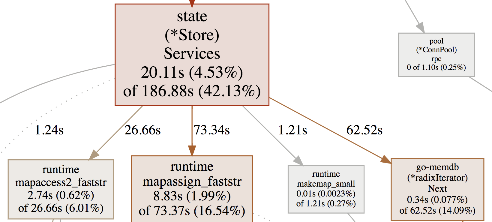

# pprof

> A Profile is a collection of stack traces showing the call sequences that led to instances of a particular event, such as allocation.

## Installation
`go install github.com/google/pprof@latest`

### CPU Profiles
* Every 10ms the CPU profiler interrupts a thread in the program and records the stack traces of **running** goroutines. 
	* It does **not** track time spent sleeping or waiting for I/O.
* The duration of a sample is assumed to be 10ms, so the seconds spent in a function is calculated as: `(num_samples * 10ms)/1000`

### Heap Profiles
*  Aims to record the stack trace for every 512KB allocated, at the point of the allocation.
	* Tracks allocations and when profiled allocations are freed. With both of these data points pprof can calculate allocations and memory in use.
* `alloc_objects` and `alloc_space` refer to allocations since the start of the profiling period.
	* Helpful for tracking functions that produce a lot of allocations.
* `inuse_objects` and `inuse_space` refers to allocations that have not been freed.
	* `inuse_objects = allocations - frees`
	* Helpful for tracking sources of high memory usage.
	* May not line up with OS reported memory usage! The profiler only tracks heap memory usage, and there are also cases where the Go GC will not release free heap memory to the OS. 
* When allocations are made, the heap sampler makes a decision about whether to sample the allocation or not. If it decides to sample it, it records the stack trace, counts the allocation, and counts the number of bytes allocated.
	* When an object's memory is freed, the heap profiler checks whether that allocation was sampled, and if it was, it counts the bytes freed. 

### Goroutine Profiles
* Shows the number of times each stack trace was seen across goroutines.

## Common commands
* Open a profile in the terminal:
`go tool pprof profile.prof`
`go tool pprof heap.prof`
`go tool pprof goroutine.prof`

* Open a profile in a web browser:
`go tool pprof -http=:8080 profile.prof`

* If the correct source isn't detected automatically, specify the location of the source associated with the profile:
`go tool pprof -http=:9090 -source_path=/Users/freddy/go/src/github.com/hashicorp/consul-enterprise profile.prof`

Useful in annotated `Source` view which shows time on a line-by-line basis.

**Important:** Ensure that the source code matches the version of the binary! The source view relies on line numbers for its annotations.

* Compare two profiles:
`go tool pprof -http=:8080 -base before/profile.prof after/profile.prof`
This comparison will subtract the `-base` profile from the given profile. In this case, "before" is subtracted from "after". 

* Useful commands when profile is opened in terminal:
	* `top` lists the top 10 nodes by value
	* `list <function regex>` lists the top matches to the pattern

## Graph view
* **Node Values:**
	* Package
	* Function
	* Flat value: the value in the function itself.
	* Cumulative value: the sum of the flat value and all its descendants.
	* Percentage of flat and cumulative values relative to total samples. Total sample time is visible with `top` command in terminal view.

Example:
```
func foo(){
    a()                                 // step 1 takes 1s
    do something directly.              // step 2 takes 3s
    b()                                 // step 3 takes 1s
}
```

`flat` is the time spent on step 2 (3s),  while `cum` is time spent on steps 1 to 3. 

* **Path Value**
	* The cumulative value of the following node.

* **Node Color**:
  * large positive cumulative values are red.
  * cumulative values close to zero are grey.
  * large negative cumulative values are green; negative values are most likely to appear during profile comparison.

* **Node Font Size**:
  * larger font size means larger absolute flat values.
  * smaller font size means smaller absolute flat values. 

* **Edge Weight**:
  * thicker edges indicate more resources were used along that path.
  * thinner edges indicate fewer resources were used along that path.

* **Edge Color**:
  * large positive values are red.
  * large negative values are green.
  * values close to zero are grey.

* **Dashed Edges**: some locations between the two connected locations were removed.  

* **Solid Edges**: one location directly calls the other.

* **"(inline)" Edge Marker**: the call has been inlined into the caller. More on inlining: [Inlining optimisations in Go | Dave Cheney](https://dave.cheney.net/2020/04/25/inlining-optimisations-in-go)

Example graph:


* 20.11s is spent doing direct work in `(*Store).Services()`
* 186.88s is spent in this function **and** its descendants
* `(*Store).Services()` has both large `flat` and `cumulative` values, so the font is large and the box is red.
* The edges to `mapassign_faststr` and `(radixIterator).Next()` are solid and red because these are direct calls with large positive values. 


## Flame graph view
A collection of stack traces, where each stack is a column of boxes, and each box represents a function.

Functions at the top of the flame graph are parents of functions below.

The width of each box is proportional to the number of times it was observed during sampling. 

Mouse-over boxes shows `cum` value and percentage, while clicking on boxes lets you zoom into their stack traces.

### Note
* The background color is **not** significant.
* Sibling boxes are not necessarily in chronological order.


## References:
* [Diagnostics - The Go Programming Language](https://go.dev/doc/diagnostics)
* [Profiling Go programs with pprof](https://jvns.ca/blog/2017/09/24/profiling-go-with-pprof/)
* [pprof/README.md](https://github.com/google/pprof/blob/master/doc/README.md)	
* [GitHub - DataDog/go-profiler-notes: felixge's notes on the various go profiling methods that are available.](https://github.com/DataDog/go-profiler-notes)
* [The Flame Graph - ACM Queue](https://queue.acm.org/detail.cfm?id=2927301)
* [High Performance Go Workshop](https://dave.cheney.net/high-performance-go-workshop/dotgo-paris.html#pprof)
* [Pprof and golang - how to interpret a results?](https://stackoverflow.com/a/56882137)