# Cluster Persistence

> **Note**
> While the content of this document is still accurate, it doesn't cover the new
> generic resource-oriented storage layer introduced in Consul 1.16. Please see
> [Resources](../resources) for more information.

The cluser persistence subsystem runs entirely in Server Agents. It handles both read and
write requests from the [RPC] subsystem. See the [Consul Architecture Guide] for an
introduction to the Consul deployment architecture and the [Consensus Protocol] used by
the cluster persistence subsystem.

[RPC]: ../rpc
[Consul Architecture Guide]: https://www.consul.io/docs/architecture
[Consensus Protocol]: https://www.consul.io/docs/architecture/consensus

[source](./overview.mmd)

## Raft and FSM

[hashicorp/raft] is at the core of cluster persistence. Raft requires an [FSM], a
finite-state machine implementation, to persist state changes. The Consul FSM is
implemented in [agent/consul/fsm] as a set of commands.

[FSM]: https://pkg.go.dev/github.com/hashicorp/raft#FSM
[hashicorp/raft]: https://github.com/hashicorp/raft
[agent/consul/fsm]: https://github.com/hashicorp/consul/tree/main/agent/consul/fsm

Raft also requires a [LogStore] to persist logs to disk. Consul uses [hashicorp/raft-boltdb]
which implements [LogStore] using [boltdb]. In the near future we should be updating to
use [bbolt].

[LogStore]: https://pkg.go.dev/github.com/hashicorp/raft#LogStore
[hashicorp/raft-boltdb]: https://github.com/hashicorp/raft-boltdb
[boltdb]: https://github.com/boltdb/bolt
[bbolt]: https://github.com/etcd-io/bbolt

## State Store

Consul stores the full state of the cluster in memory using the state store. The state store is
implemented in [agent/consul/state] and uses [hashicorp/go-memdb] to maintain indexes of
data stored in a set of tables. The main entrypoint to the state store is [NewStateStore].

[agent/consul/state]: https://github.com/hashicorp/consul/tree/main/agent/consul/state
[hashicorp/go-memdb]: https://github.com/hashicorp/go-memdb
[NewStateStore]: https://github.com/hashicorp/consul/blob/main/agent/consul/state/state_store.go

### Tables, Schemas, and Indexes

The state store is organized as a set of tables, and each table has a set of indexes.
`newDBSchema` in [schema.go] shows the full list of tables, and each schema function shows
the full list of indexes.

[schema.go]: https://github.com/hashicorp/consul/blob/main/agent/consul/state/schema.go

There are two styles for defining table indexes. The original style uses generic indexer
implementations from [hashicorp/go-memdb] (ex: `StringFieldIndex`). These indexes use
[reflect] to find values for an index. These generic indexers work well when the index
value is a single value available directly from the struct field, and there are no
oss/enterprise differences.

The second style of indexers are custom indexers implemented using only functions and
based on the types defined in [indexer.go]. This style of index works well when the index
value is a value derived from one or multiple fields, or when there are oss/enterprise
differences between the indexes.

[reflect]: https://golang.org/pkg/reflect/
[indexer.go]: https://github.com/hashicorp/consul/blob/main/agent/consul/state/indexer.go

## Snapshot and Restore

Snapshots are the primary mechanism used to backup the data stored by cluster persistence.
If all Consul servers fail, a snapshot can be used to restore the cluster back
to its previous state.

Note that there are two different snapshot and restore concepts that exist at different
layers. First there is the `Snapshot` and `Restore` methods on the raft [FSM] interface,
that Consul must implement. These methods are implemented as mostly passthrough to the
state store. These methods may be called internally by raft to perform log compaction
(snapshot) or to bootstrap a new follower (restore). Consul implements snapshot and
restore using the `Snapshot` and `Restore` types in [agent/consul/state].

Snapshot and restore also exist as actions that a user may perform. There are [CLI]
commands, [HTTP API] endpoints, and [RPC] endpoints that allow a user to capture an
archive which contains a snapshot of the state, and restore that state to a running
cluster. The [consul/snapshot] package provides some of the logic for creating and reading
the snapshot archives for users. See [commands/snapshot] for a reference to these user
facing operations.

[CLI]: ../cli
[HTTP API]: ../http-api
[commands/snapshot]: https://www.consul.io/commands/snapshot
[consul/snapshot]: https://github.com/hashicorp/consul/tree/main/snapshot

Finally, there is also a [snapshot agent] (enterprise only) that uses the snapshot API
endpoints to periodically capture a snapshot, and optionally send it somewhere for
storage. 

[snapshot agent]: https://www.consul.io/commands/snapshot/agent

## Raft Autopilot

[hashicorp/raft-autopilot] is used by Consul to automate some parts of the upgrade process.

[hashicorp/raft-autopilot]: https://github.com/hashicorp/raft-autopilot
