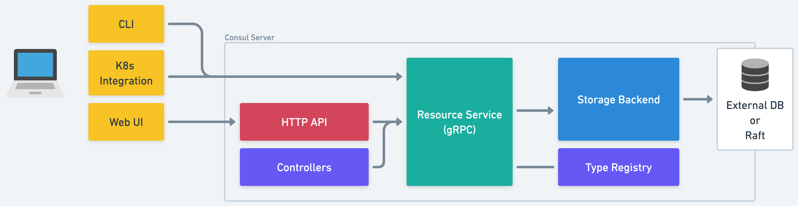
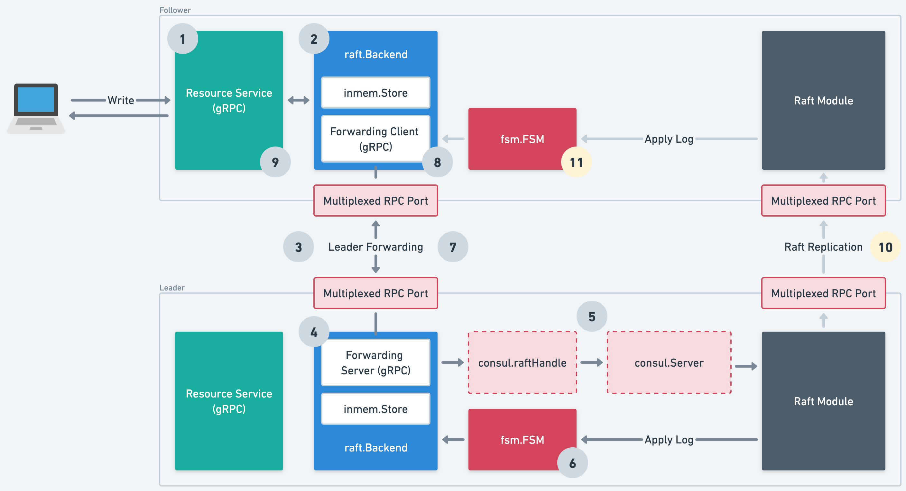

# Resources

> **Note**  
> Looking for guidance on adding new resources and controllers to Consul? Check
> out the [developer guide](./guide.md).

Consul 1.16 introduced a set of [generic APIs] for managing resources, and a
[controller runtime] for building functionality on top of them.

[generic APIs]: ../../proto-public/pbresource/resource.proto
[controller runtime]: ../../internal/controller

Previously, adding features to Consul involved making changes at every layer of
the stack, including: HTTP handlers, RPC handlers, MemDB tables, Raft
operations, and CLI commands.

This architecture made sense when the product was maintained by a small core
group who could keep the entire system in their heads, but presented significant
collaboration, ownership, and onboarding challenges when our contributor base
expanded to many engineers, across several teams, and the product grew in
complexity.

In the new model, teams can work with much greater autonomy by building on top
of a shared platform and own their resource types and controllers.

## Architecture Overview

[source](https://whimsical.com/state-store-v2-UKE6SaEPXNc4UrZBrZj4Kg)

Our resource-oriented architecture comprises the following components:

#### Resource Service

[Resource Service](../../proto-public/pbresource/resource.proto) is a gRPC
service that contains the shared logic for creating, reading, updating,
deleting, and watching resources. It will be consumed by controllers, our
Kubernetes integration, the CLI, and mapped to an HTTP+JSON API.

#### Type Registry

[Type Registry](../../internal/resource/registry.go) is where teams register
their resource types, along with hooks for performing structural validation,
authorization, etc.

#### Storage Backend

[Storage Backend](../../internal/storage/storage.go) is an abstraction over
low-level storage primitives. Today, there are two implementations (Raft and
an in-memory backend for tests) but in the future, we envisage external storage
systems such as the Kubernetes API or an RDBMS could be supported which would
reduce operational complexity for our customers.

#### Controllers

[Controllers](../../internal/controller/api.go) implement Consul's business
logic using asynchronous control loops that respond to changes in resources.

## Raft Storage Backend

Our [Raft Storage Backend](../../internal/storage/raft/backend.go) integrates
with the existing Raft machinery (e.g. FSM) used by the [old state store]. It
also transparently forwards writes and strongly consistent reads to the leader
over gRPC.

There's quite a lot going on here, so to dig into the details, let's take a look
at how a write operation is handled.

[old state store]: ../persistence/

[source](https://whimsical.com/state-store-v2-UKE6SaEPXNc4UrZBrZj4Kg)

#### Steps 1 & 2

User calls the resource service's `Write` endpoint, on a Raft follower, which
in-turn calls the storage backend's `WriteCAS` method.

#### Steps 3 & 4

The storage backend determines that the current server is a Raft follower, and
forwards the operation to the leader via a gRPC [forwarding service] listening
on the multiplexed RPC port ([`ports.server`]).

[forwarding service]: ../../proto/private/pbstorage/raft.proto
[`ports.server`]: https://developer.hashicorp.com/consul/docs/agent/config/config-files#server_rpc_port

#### Step 5

The leader's storage backend serializes the operation to protobuf and applies it
to the Raft log. As we need to share the Raft log with the old state store, we go
through the [`consul.raftHandle`](../../agent/consul/raft_handle.go) and
[`consul.Server`](../../agent/consul/server/server.go) which applies a msgpack
envelope and type byte prefix.

#### Step 6

Raft consensus happens! Once the log has been committed, it is applied to the
[FSM](../../agent/consul/fsm/fsm.go) which calls the storage backend's `Apply`
method to apply the protobuf-encoded operation to the [`inmem.Store`].

[`inmem.Store`]: ../../internal/storage/inmem/store.go

#### Steps 7, 8, 9

At this point, the operation is complete. The forwarding service returns a
successful response, as does the follower's storage backend, and the user
gets a successful response too.

#### Steps 10 & 11

Asynchronously, the log is replicated to followers and applied to their storage
backends.
