# RPC

Consul uses two RPC systems for communication between components within the
cluster and with other clients such as Envoy: [gRPC](https://grpc.io/)
and Go's [`net/rpc`](https://pkg.go.dev/net/rpc) package.

Communication between client agents and servers uses a mix of both gRPC and
`net/rpc`. Generally, gRPC is preferred because it supports modern features
such as context deadlines/cancellation, streaming, and middleware - but Consul
has been around for a while so the majority of RPC endpoints still use `net/rpc`.

## Multiplexed "Server" Port

Most in-cluster communication happens over the multiplexed "server" TCP port
(default: 8300). Consul servers implement a custom protocol for serving
different kinds of traffic on the same port, whereby the first byte sent
indicates the protocol (e.g. gRPC, `net/rpc`, Raft).

Servers also implement [TLS ALPN](https://en.wikipedia.org/wiki/Application-Layer_Protocol_Negotiation)
on this port, for situations where wrapping the real protocol with a byte prefix
isn't practical (e.g. cross-DC traffic over mesh gateways).

The diagram below shows all the possible routing flows:

[server port]: https://developer.hashicorp.com/consul/docs/agent/config/config-files#server



<sup>[source](./routing.mmd)</sup>

The main entrypoint to connection routing is `handleConn` in [agent/consul/rpc.go].

[agent/consul/rpc.go]: https://github.com/hashicorp/consul/blob/main/agent/consul/rpc.go

### Development

Multiplexing several protocols over a single server port helps to reduce our
network requirements, but also makes interacting with Consul using local
development tools such as [grpcurl] difficult.

[grpcurl]: https://github.com/fullstorydev/grpcurl

You can get a "plain" TCP connection to the gRPC server using this proxy script:

```
$ go run tools/internal-grpc-proxy/main.go localhost:8300
Proxying connections to Consul's internal gRPC server
Use this address: 127.0.0.1:64077
```

Pass the returned proxy address to your tool of choice.

## Private vs Public vs Internal vs External
When working on Consul's gRPC endpoints you may notice we use private/public and
internal/external slightly differently.

Private and public refer to whether an API is suitable for consumption by
clients other than Consul's core components.

Private gRPC APIs are defined in the `proto` directory, and should only be used
by Consul servers and agents. Public gRPC APIs are defined in the `proto-public`
directory and may be used by 3rd-party applications.

Internal and external refer to how the gRPC APIs are exposed.

Internal gRPC APIs are exposed on the multiplexed "server" port, whereas
external APIs are exposed on a dedicated gRPC port (default: 8502).

The reason for this differentiation is that some private APIs are exposed on the
external port, such as peer streaming/replication; this API isn't (yet) suitable
for consumption by 3rd-party applications but must be accessible from outside
the cluster, and present a TLS certificate signed by a public CA, which the
multiplexed port cannot.

## RPC Endpoints

This section is a work in progress, it will eventually cover topics like:

- net/rpc - (in the stdlib)
- new grpc endpoints
- [Streaming](./streaming)
- [agent/structs](https://github.com/hashicorp/consul/tree/main/agent/structs) - contains definitions of all the internal RPC protocol request and response structures.


## RPC connections and load balancing

This section is a work in progress, it will eventually cover topics like:

Routing RPC request to Consul servers and for connection pooling.

- [agent/router](https://github.com/hashicorp/consul/tree/main/agent/router)
- [agent/pool](https://github.com/hashicorp/consul/tree/main/agent/pool)
