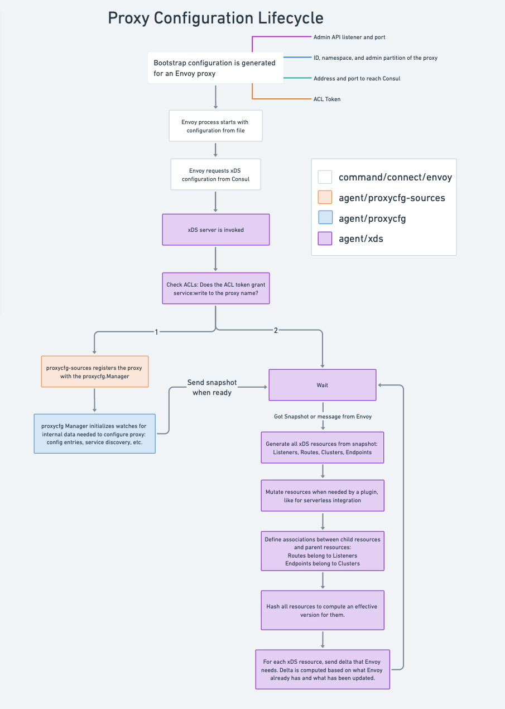

# Service Mesh (Connect)
## Terminology
### Data plane
The data plane refers to gateways, sidecar proxies, or native application libraries that are in the request path of applications and embed service mesh logic around routing, authorization, and observability.

For production deployments we primarily support [Envoy](https://www.envoyproxy.io/) proxy. Active development of service mesh functionality is focused on Envoy.

### Control plane
At a high level, the primary goal of the control plane in a service mesh is to provide configuration for the data plane. Consul's service mesh is composed of: server agents, client agents, and [consul-dataplane](https://github.com/hashicorp/consul-dataplane) proxies.

The control plane allows users to configure policies for the service mesh, and then translates these into configuration that the data plane components will use to execute the intended functionality.

A key distinction from the data plane is that the control plane is largely not in the request path of service to service traffic. The notable exception to this rule is the [/agent/connect/authorize](https://developer.hashicorp.com/consul/api-docs/agent/connect#authorize), discussed in the Native integration below.

### Connect Native
Consul's service mesh supports a "native" app integration. In this setup users must explicitly request leaf and root certificates from Consul for use in service-to-service mTLS. Additionally, to consider intentions for authorization, applications can issue an authorization check to a Consul agent.

The Go client library for this integration exists in the [connect](https://github.com/hashicorp/consul/tree/main/connect) package.

**APIs:**
* [/agent/connect/authorize](https://developer.hashicorp.com/consul/api-docs/agent/connect#authorize) can be used to evaluate whether intentions allow connections by a client to some target service.
* [/agent/connect/ca/leaf/:service](https://developer.hashicorp.com/consul/api-docs/agent/connect#service-leaf-certificate) can be used to request a leaf certificate for a service instance. This is the certificate to present during the mTLS handshake
* [/agent/connect/ca/roots](https://developer.hashicorp.com/consul/api-docs/agent/connect#certificate-authority-ca-roots) can be used to request the trusted certificate authority's root certificates. These are the certificates used to verify leaf certificates presented in the mTLS handshake.

### Built-in Proxy
Consul's service mesh was released with a built-in proxy. This proxy provides basic functionality as outlined in its [documentation](https://developer.hashicorp.com/consul/docs/connect/proxies/built-in). This proxy is not supported for production deployments and has not been under active development for several years.

The core of the built-in proxy is implemented in the [connect/proxy](https://github.com/hashicorp/consul/tree/main/connect/proxy) package, and is launched by the [command/connect/proxy](https://github.com/hashicorp/consul/tree/main/command/connect/proxy) package.

## Configuration Lifecycle

The high-level flow of configuring Envoy is:
1. The initial "bootstrap" configuration is generated for an Envoy proxy by a consul-dataplane instance or a Consul client agent.
2. Envoy dials the xDS server, requesting configuration to act as a particular proxy or gateway instance. The xDS server will either be a Consul server or a Consul client agent.
3. Consul initializes internal watches for the snapshot of data necessary to configure Envoy. This snapshot will contain data as collected from Consul's state.
4. As these snapshots are generated and updated, Consul will generate and push Envoy configuration for the various xDS resource types if there were changes.

### Bootstrapping Envoy proxies
Consul generates the initial "bootstrap" configuration file for Envoy proxy instances, and can optionally launch the Envoy process itself.

The basic information provided in Envoy's bootstrap configuration contains:
* The listener address and port for [Envoy's administration interface](https://www.envoyproxy.io/docs/envoy/latest/operations/admin).
* The ID, namespace, and admin partition of the corresponding sidecar proxy registration in Consul's catalog.
* Configuration on how to reach Consul, and the Consul ACL token to present.

This process is handled by two different components depending on whether Consul client agents are in use:
* [consul-dataplane](https://github.com/hashicorp/consul-dataplane) is used in "agentless" Consul.
* [command/connect/envoy](https://github.com/hashicorp/consul/tree/main/command/connect/envoy) is used with Consul agents.

### Internal resource watches
The `proxycfg-*` family of packages drive the process of generating snapshots containing all of the data necessary to configure an Envoy proxy. This snapshot is populated via internal watches to resources such as configuration entries and service registrations.

When initialized on a client agent these watches flow through the agent cache, which manages the associated blocking queries. On the other hand, when initialized on a Consul server these watches are done directly against the server's in-memory state store.

For additional details see: [proxycfg](./proxycfg.md).

### Generating xDS Configuration
The `agent/xds` package implements the gRPC service used by Envoy to fetch configuration.  At the core of the package is [delta.go](https://github.com/hashicorp/consul/blob/main/agent/xds/delta.go), which contains the implementation of the **Incremental ADS** protocol variant.  With this variant there is a single stream between Consul and an Envoy proxy, and on that stream we send configuration diffs based on Envoy's current state.

This package also contains files that generate xDS resources such as Clusters, Endpoints, Listeners, and Routes from snapshots generated by `proxycfg`. These files handle the conversion from Consul's data model to Envoy's.

For additional details see: [xDS Server](./xds.md) and [Envoy's documentation](https://www.envoyproxy.io/docs/envoy/latest/api-docs/xds_protocol) on the xDS protocol.

## Additional Components
### Certificate Authority
Consul's certificate authority is the component responsible for certificate management in the service mesh. Certificates issued by the certificate authority are used for two primary reasons:
* mTLS between mesh-enabled applications.
* Intention enforcement.
* TLS between components of the control plane, such as: client agent to server agent when using [auto-config](https://developer.hashicorp.com/consul/tutorials/security-operations/docker-compose-auto-config), or leader server agent to the leader server of a peer cluster.

For additional details see: [Certificate Authority](./ca) and the [public documentation](https://developer.hashicorp.com/consul/docs/connect/ca).

### Configuration Entries
Configuration entries are the primary way to apply configuration or policies uniformly across the mesh. They are stored centrally on Consul's servers, and can be scoped to a service, namespace, admin partition, or a federation of datacenters.

For additional details see: [Configuration Entries](./config-entries) and the [public documentation](https://developer.hashicorp.com/consul/docs/connect/config-entries).
