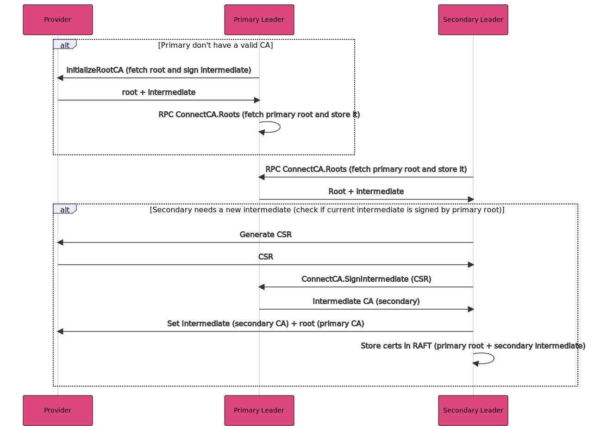

# Certificate Authority (Connect CA)

The Certificate Authority Subsystem manages a CA trust chain for issuing certificates to
services and client agents (via auto-encrypt and auto-config).

The code for the Certificate Authority is in the following packages:
1. most of the core logic is in [agent/consul/leader_connect_ca.go]
2. the providers are in [agent/connect/ca]
3. the RPC interface is in [agent/consul/connect_ca_endpoint.go]

[agent/consul/leader_connect_ca.go]: https://github.com/hashicorp/consul/blob/main/agent/consul/leader_connect_ca.go
[agent/connect/ca]: https://github.com/hashicorp/consul/blob/main/agent/connect/ca/
[agent/consul/connect_ca_endpoint.go]: https://github.com/hashicorp/consul/blob/main/agent/consul/connect_ca_endpoint.go

## Architecture

### High level overview

In Consul the leader is responsible for handling the CA management. 
When a leader election happen, and the elected leader do not have any root CA available it will start a process of creating a set of CA certificate.
Those certificates will be used to authenticate/encrypt communication between services (service mesh) or between `Consul client agent` (auto-encrypt/auto-config). This process is described in the following diagram:

[source](./hl-ca-overview.mmd)

The features that benefit from Consul CA management are:
- [service Mesh/Connect](https://developer.hashicorp.com/consul/docs/connect)
- [auto encrypt](https://developer.hashicorp.com/consul/docs/agent/config/config-files#auto_encrypt)

### CA and Certificate relationship

This diagram shows the relationship between the CA certificates in Consul primary and
secondary.

[source](./cert-relationship.mmd)

In most cases there is an external root CA that provides an intermediate CA that Consul
uses as the Primary Root CA. The only except to this is when the Consul CA Provider is
used without specifying a `RootCert`. In this one case Consul will generate the Root CA
from the provided primary key, and it will be used in the primary as the top of the chain
of trust.

In the primary datacenter, the Consul and AWS providers use the Primary Root CA to sign
leaf certificates. The Vault provider uses an intermediate CA to sign leaf certificates.

Leaf certificates are created for two purposes:
1. the Leaf Cert Service is used by envoy proxies in the mesh to perform mTLS with other
   services.
2. the Leaf Cert Client Agent is created by auto-encrypt and auto-config. It is used by
   client agents for HTTP API TLS, and for mTLS for RPC requests to servers.

Any secondary datacenters receive an intermediate certificate, signed by the Primary Root
CA, which is used as the CA certificate to sign leaf certificates in the secondary
datacenter.

## Operations

When trying to learn the CA subsystem it can be helpful to understand the operations that
it can perform. The sections below are the complete set of read, write, and periodic
operations that provide the full behaviour of the CA subsystem.

### Periodic Operations

Periodic (or background) opeartions are started automatically by the Consul leader. They run at some interval (often 1 hour).

- `CAManager.InitializeCA` - attempts to initialize the CA when a leader is ellected. If the synchronous InitializeCA fails, `CAManager.backgroundCAInitialization` runs `InitializeCA` periodically in a goroutine until it succeeds.
- `CAManager.RenewIntermediate` - (called by `CAManager.intermediateCertRenewalWatch`) runs in the primary if the provider uses a separate signing cert (the Vault provider). The operation always runs in the secondary. Renews the signing cert once half its lifetime has passed.
- `CAManager.secondaryCARootWatch` - runs in secondary only. Performs a blocking query to the primary to retrieve any updates to the CA roots and stores them locally.
- `Server.runCARootPruning` - removes non-active and expired roots from state.CARoots

### Read Operations

- `RPC.ConnectCA.ConfigurationGet` - returns the CA provider configuration. Only called by user, not by any internal subsystems.
- `RPC.ConnectCA.Roots` - returns all the roots, the trust domain ID, and the ID of the active root. Each "root" also includes the signing key/cert, and any intermediate certs in the chain. It is used (via the cache) by all the connect proxy types.

### Write Operations

- `CAManager.UpdateConfiguration` - (via `RPC.ConnectCA.ConfigurationSet`) called by a user when they want to change the provider or provider configuration (ex: rotate root CA).
- `CAManager.Provider.SignIntermediate` - (via `RPC.ConnectCA.SignIntermediate`) called from the secondary DC:
    1. by `CAManager.RenewIntermediate` to sign the new intermediate when the old intermediate is about to expire
    2. by `CAMananger.initializeSecondary` when setting up a new secondary, when the provider is changed in the secondary
   by a user action, or when the primary roots changed and the secondary needs to generate a new intermediate for the new
   primary roots.
- `CAMananger.SignCertificate` - is used by:
    1. (via `RPC.ConnectCA.Sign`) - called by client agents to sign a leaf cert for a connect proxy (via `agent/cache-types/connect_ca_leaf.go`)
    2. (via in-process call to `RPC.ConnectCA.Sign`) - called by auto-encrypt to sign a leaf cert for a client agent
    3. called by Auto-Config to sign a leaf cert for a client agent

## detailed call flow

[source](./ca-leader-sequence.mmd)

####TODO:
- sequence diagram for leaf signing 
- sequence diagram for CA cert rotation

## CAManager states

This section is a work in progress

TODO: style the diagram to match the others, and add some narative text to describe the
diagram.

