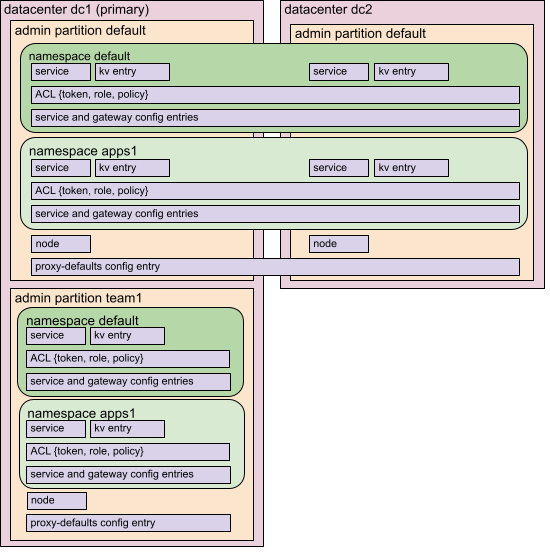
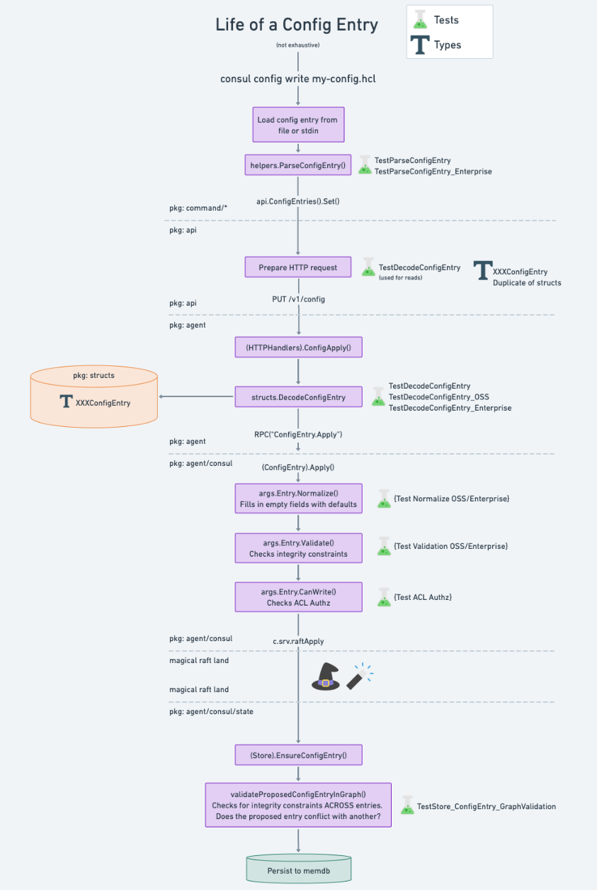

# Configuration Entries
## Background
Consul's catalog was designed to store node, service, and check registrations. An instance of a service is defined by a combination of a node and a service registered against that node. Each of these service registrations is considered to be an _instance_ of a logical service.

Logical services in consul are implicit. There is no true logical service "object" that defines the existence of a service. In Consul, a service is a collection of service instances. When the first instance of a service is registered, the service becomes known, and when the last instance is deregistered then the service is mostly forgotten.

The lack of a first-class service object makes it so that the source of truth for the configuration of a service is the configuration of its service instances. Registering services at the edge has the side-effect of making it more challenging to enforce uniform configuration across service or proxy instances.

## Overview
Configuration entries are the primary way to apply configuration or policies uniformly across the mesh. They are stored centrally on Consul's servers, and can be scoped to a service, namespace, a cluster, or a federation of datacenters.

With WAN-federation, the scope of config entries spans across Consul datacenters. All config entry writes are forwarded to the primary datacenter, and each secondary datacenter has blocking queries to the primary datacenter so that they can replicate in the latest entries. The implications of their global scope means that a config entry referencing service "web" in namespace "frontend" will apply to **all** services named "web" in a namespace called "frontend"  across federated datacenters.

Since the introduction of admin partitions in Consul v1.11.0, the broadest scope for a config entry is a partition. A service a namespace of one partition is logically distinct from a service with the same name and namespace in another partition.

This restriction also applies when peering two clusters. As of Consul 1.14, configuration entries are not replicated to peer clusters.  Configuration entries applied in one cluster do not apply to services in a peer cluster because services in different clusters that share the same name are considered to be logically different.

The diagram below shows how various resources are scoped:
* Service and gateway config entries exist within a namespace but can span across WAN federated datacenters, just as namespaces can.
* The proxy-defaults config entry is not namespaced, but can similarly span across datacenters.
* Config entries in admin partition "default" are logically distinct from config entries in other admin partitions like "team1".

For sidecar proxies the fundamental config entries are [service-defaults](https://developer.hashicorp.com/consul/docs/connect/config-entries/service-defaults) and [proxy-defaults](https://developer.hashicorp.com/consul/docs/connect/config-entries/proxy-defaults). These config entries can be thought of as default values for proxy or gateway service registrations. Their data gets merged into proxy service registrations themselves.

As defaults, their data is of lower precedence compared to data stored in proxy registrations. In Consul, data present in individual proxy registrations **always** has a higher precedence than the equivalent stored in a configuration entry.

## Additional Information:
- [Config Resolution](config-resolution.md): Summary of the mechanics of how configuration entries are resolved for sidecar proxies.

## Lifecycle

The diagram below shows the lifecycle of a configuration entry along with the locations where the concrete types are stored and common tests. The steps highlighted along these paths are ones that will likely require code or test updates when modifying a config entry or adding a new config entry kind.

