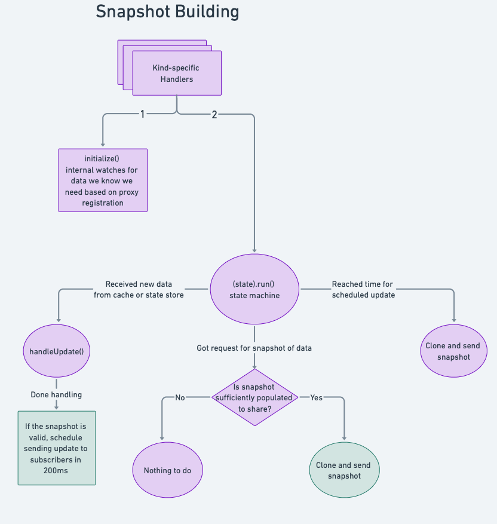
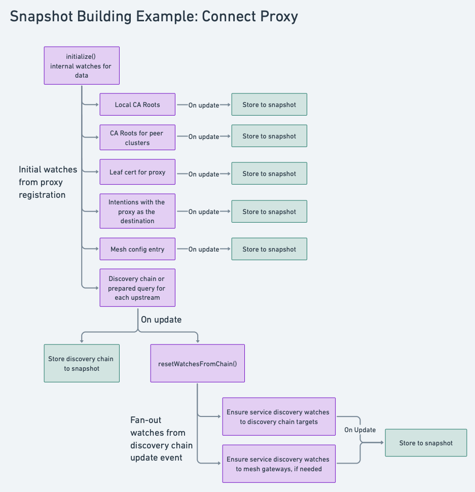

# Proxycfg
The `proxycfg-*` family of packages drive the process of generating snapshots containing all of the data necessary to configure an Envoy proxy. This snapshot is populated via internal watches to resources such as configuration entries and service registrations.

When initialized on a client agent these watches flow through the agent cache, which manages the associated blocking queries. On the other hand, when initialized on a Consul server these watches are done directly against the server's in-memory state store.

## agent/proxycfg
### Manager
The `proxycfg.Manager` is responsible for initializing or tearing down the machinery required to watch the internal data required to configure an Envoy proxy. This includes initializing the snapshots of internal data for proxy configuration, kicking off the long-running update routines, and managing the delivery of snapshots to the xDS server.



### State management
Building a snapshot of data to configure a proxy is done with a long-running event-processing state machine. When a proxy is first registered with the manager we initialize the known watches that are needed based on the kind of proxy or gateway being watched. Each of these watches will contain the necessary request type, as well as a `CorrelationID`, which acts as a key for the watch. If a watch will not exist for the duration of a proxy instance, we also store a context cancellation function so that the watch can be torn down later.

The results of these watches are then consumed as a stream of update events to a channel. Any time a new event is received, the `handleUpdate` function is called, which contains kind-specific logic. For each new event the `CorrelationID` is inspected to determine what watch the event corresponds to. From an event we may store the data directly or initialize/destroy additional watches.

Since the event updates are processed concurrently, the way to ensure ordering is via chained watches. For example, the discovery chain dictates what upstream instances need to be watched for a logical upstream. Once a discovery chain update is received we then kick off a service discovery watch for the appropriate targets.



## agent/proxycfg-glue
The dependencies to watch data on Consul's servers are encoded in `proxycfg.DataSources`. For any given resource to watch there is a corresponding data source, which is contained in the `DataSources` type as an interface. These interfaces are uniform:

```go
type <RESOURCE> interface {
	Notify(ctx context.Context, req *structs.ServiceDumpRequest, correlationID string, ch chan<- UpdateEvent) error
}
```

Implementations for these interfaces exist within the `proxycfg-glue` package. When using the agentless consul-dataplane the implementation names have the structure: `Server<Resource>`, and when using client agents these implementations have the structure: `Cache<Resource>`.

For each resource there are parallel implementations that use the agent's cache as the data source or the server's state store. Requests to the state store may use subscriptions to Consul's internal event publisher, or a memdb WatchSet. For more information about the event publisher see the [streaming documentation](/docs/rpc/streaming).

If the event publisher contains the necessary data it is preferable to use that as the server datasource over a memdb WatchSet. Memdb's watch sets are susceptible to spurious wake-ups and may lead to doing more work than strictly necessary when a change occurs. The event publisher watches memdb tables for changes and broadcasts incremental events based on the data that changed. It explicitly avoids re-generating all the data for the key being watched.

## agent/proxycfg-sources
Contains implementations of the `agent/xds/ProxyConfigSource` interface, which ensures that proxy instances are registered or deregistered with the `proxycfg.Manager`.

There are two distinct implementations split across two packages. Both of these registers, re-registers, or deregisters watches with the `proxycfg.Manager`.
* `/agent/proxycfg-sources/local`: Path exercised by Consul client agents.
* `/agent/proxycfg-sources/catalog`: Path exercised by Consul server agents.

The primary reason why these two implementations are separate is due to how proxy service registrations are handled in agentless and agentful deployments:
* Server agents watch the catalog for proxy registration changes, while client agents watch their local state
* Server agents merge data from service-defaults and proxy-defaults configuration entries at the `catalog.ConfigSource` sync function, while client agents merge them by hooking into the service registration code path.
