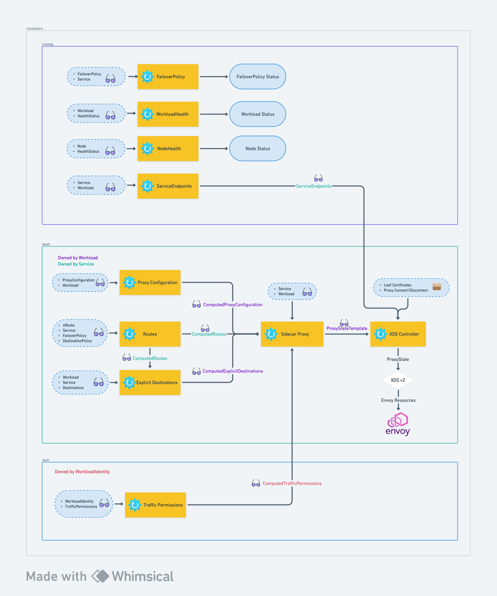

# V2 Service Mesh Architecture

In Consul 1.16 and 1.17 releases, Consul's service mesh has been rewritten to use the controller architecture and the
resource APIs.

At a high level, the service mesh consists of resources and controllers living in three groups: `catalog`, `mesh`,
and `auth`.

The controllers in each groups are responsible for producing an output that may then be used by other controllers.

-> **Note:** This diagram is valid as of Consul 1.17. It may change in the future releases.

## Catalog controllers

Catalog controllers are responsible for reconciling resources in the `catalog` API group.

1. **FailoverPolicy** controller validates `FailoverPolicy` resource has valid service references and updating the
   status the `FailoverPolicy` resource with the result.
2. **WorkloadHealth** controller takes in workloads and any relevant health statuses and updates the status of a
   workload with the combined health status.
3. **NodeHealth** controller takes in nodes and any relevant health statuses and updates the status of a node with the
   combined health status.
4. **ServiceEndpoints** controller generates a `ServiceEndpoints` object that is name-aligned with a service and
   contains workload addresses and ports that constitute a service.

## Mesh Controllers

1. **ProxyConfiguration** controller generates a `ComputedProxyConfiguration` resource that is name-aligned with a
   workload. `ComputedProxyConfiguration` contains all merged `ProxyConfiguration` resources that apply to a specific
   workload.
2. **Routes** controller generates a `ComputedRoutes` resource that is name-aligned with a service. It contains merged
   configuration from all xRoutes objects as well as `FailoverPolicy` and `DestinationPolicy`.
3. **ExplicitDestinations** controller generates a `ComputedExplicitDestinations` resource that is name-aligned with a
   workload. It contains merged `Destinations` resources that apply to a specific workload.
4. **SidecarProxy** controller takes in the results of the previous three controllers as well as some user-provided
   resources and generates `ProxyStateTemplate` resource which serves as the representation of Envoy configuration for
   sidecar proxies.
5. **XDSController** takes in `ProxyStateTemplate` resources, fills in missing endpoints references as well as
   certificates and CA roots and sends them over to another component that sends this information over to Envoy.

## Auth Controllers

1. **TrafficPermissions** controller generates `ComputedTrafficPermissions` resource that is name-aligned
   with `WorkloadIdentity`. This computed resource contains all traffic permissions that apply to a specific workload
   identity.