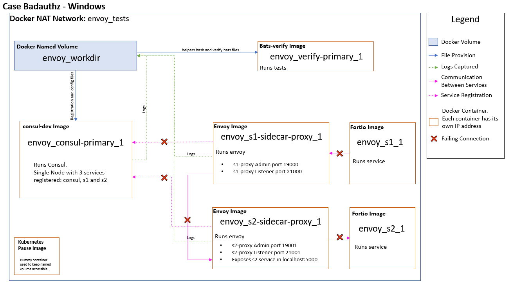

# Windows Testing Architecture

## Index

- [About](#about)
- [Testing Architectures](#testing-architectures)
  - [Linux Test Architecture](#linux-test-architecture)
  - [Replicating the Linux Test Architecture on Windows](#replicating-the-linux-test-architecture-on-windows)
  - [Single Container Test Architecture](#single-container-test-architecture)
    - [Docker Image Components](#docker-image-components)
      - Main Components:
        - [Bats](#bats)
        - [Fortio](#fortio)
        - [Jaegertracing](#jaegertracing)
        - [Openzipkin](#openzipkin)
        - [Socat](#socat)
      - Additional tools:
        - [Git Bash](#git-bash)
        - [JQ](#jq)
        - [Netcat](#netcat)
        - [Openssl](#openssl)

## About

The purpose of this document is not only to explain why the testing architecture is different on Windows but also to describe how the Single Container test architecture is composed.

## Testing Architectures

### Linux Test Architecture

On Linux, tests take advantage of the Host network feature (only available for Linux containers). This means that every container within the network shares the host’s networking namespace. The network stack for every container that uses this network mode won’t be isolated from the Docker host and won’t get their own IP address.  

Every time a test is run, a directory called workdir is created, here all the required files to run the tests are copied. Then this same directory is mounted as a **named volume**, a container with a Kubernetes pause image tagged as *envoy_workdir_1* is run to keep the volume accessible as other containers start while running the tests. Linux containers allow file system operations on runtime unlike Windows containers.  

### Replicating the Linux Test Architecture on Windows

As we previously mentioned, on Windows there is no Host networking feature, so we went with NAT network instead. The main consequences of this is that now each container has their own networking stack (IP address) separated from each other, they can communicate among themselves using Docker's DNS feature (using the containers name) but no longer through localhost.  
Another problem we are facing while sticking to this architecture, is that configuration files assume that every service (services run by fortio and Envoy's sidecar proxy service) are running in localhost. Though we had some partial success on modifying those files on runtime still we are finding issues related to this.
Test's assertions are composed of either function calls or curl executions, we managed this by mapping those calls to the corresponding container name.

Above, the failing connections are depicted. We kept the same architecture as on Linux and worked around trying to solve those connectivity issues.  
Finally, after serveral tries, it was decided that instead of replicating the Linux architecture on Windows, it was more straightforward just to have a single container with all the required components to run the tests. This **single container** test architecture is the approach that works best on Windows.

## Single Container Test Architecture

As mentioned above, the single container approach, means building a Windows Docker image not only with Consul and Envoy, but also with all the tools required to execute the existing Envoy integration tests.  

Below you can find a list and a brief description of those components.  

### Docker Image Components

The Docker image used for the Consul - Envoy integration tests has several components needed to run those tests.

- Main Components:
  - [Bats](#bats)
  - [Fortio](#fortio)
  - [Jaegertracing](#jaegertracing)
  - [Openzipkin](#openzipkin)
  - [Socat](#socat)
- Additional tools:
  - [Git Bash](#git-bash)
  - [JQ](#jq)
  - [Netcat](#netcat)
  - [Openssl](#openssl)

#### Bats

BATS stands for Bash Automated Testing System and is the one in charge of executing the tests.

#### Fortio

Fortio is a microservices (http, grpc) load testing library, command line tool, advanced echo server, and web UI. It is used to run the services registered into Consul during the integration tests.

#### Jaegertracing

Jaeger is open source software for tracing transactions between distributed services. It's used for monitoring and troubleshooting complex microservices environments. It is used along with Openzipkin in some test cases.

#### Openzipkin

Zipkin is also a tracing software.

#### Socat

Socat is a command line based utility that establishes two bidirectional byte streams and transfers data between them. On this integration tests it is used to redirect Envoy's stats. There is no official Windows version. We are using this unofficial release available [here](https://github.com/tech128/socat-1.7.3.0-windows).

#### Git Bash

This tool is only used in Windows tests, it was added to the Docker image to be able to use some Linux commands during test execution.  

#### JQ

Jq is a lightweight and flexible command-line JSON processor. It is used in several tests to modify and filter JSON outputs.

#### Netcat

Netcat is a simple program that reads and writes data across networks, much the same way that cat reads and writes data to files.

#### Openssl

Open SSL is an all-around cryptography library that offers open-source application of the TLS protocol. It is used to verify that the correct tls certificates are being provisioned during tests.
