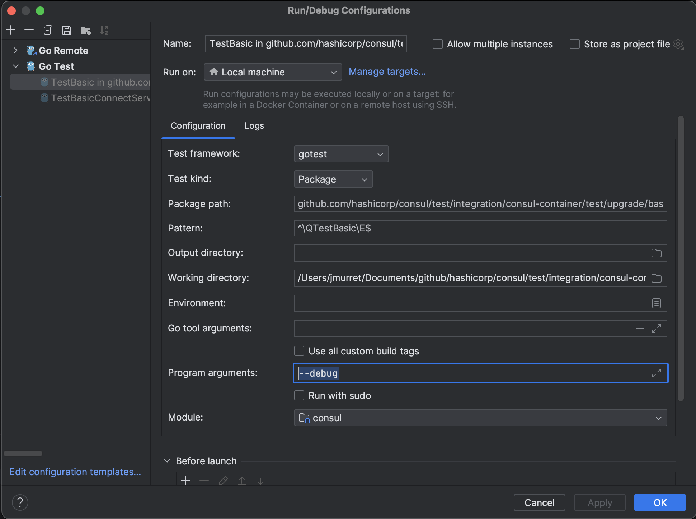
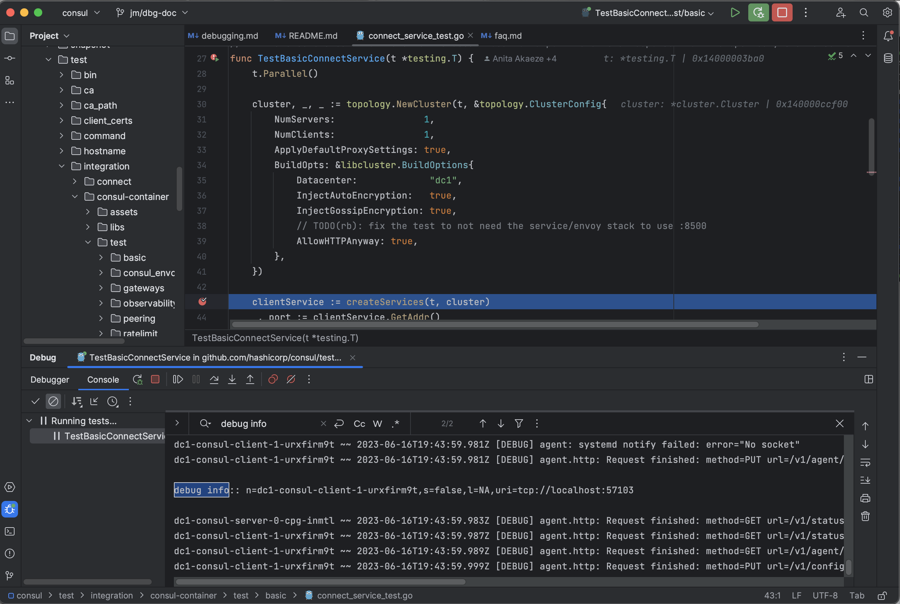
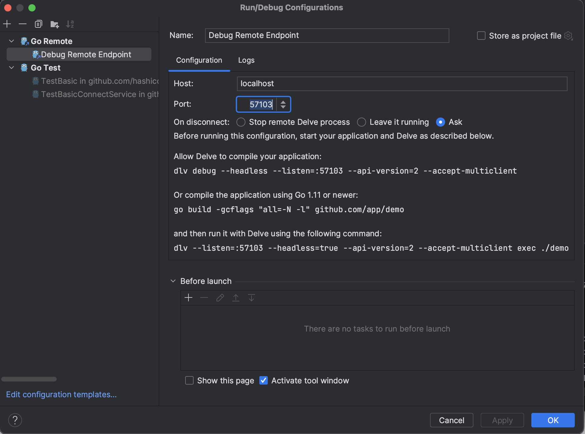
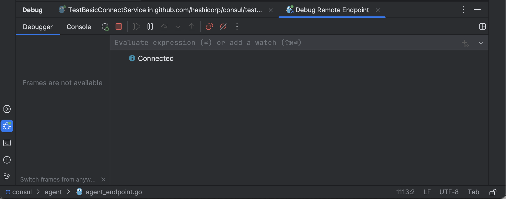
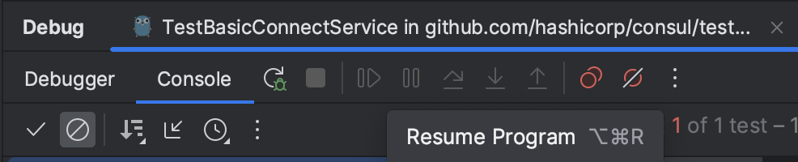
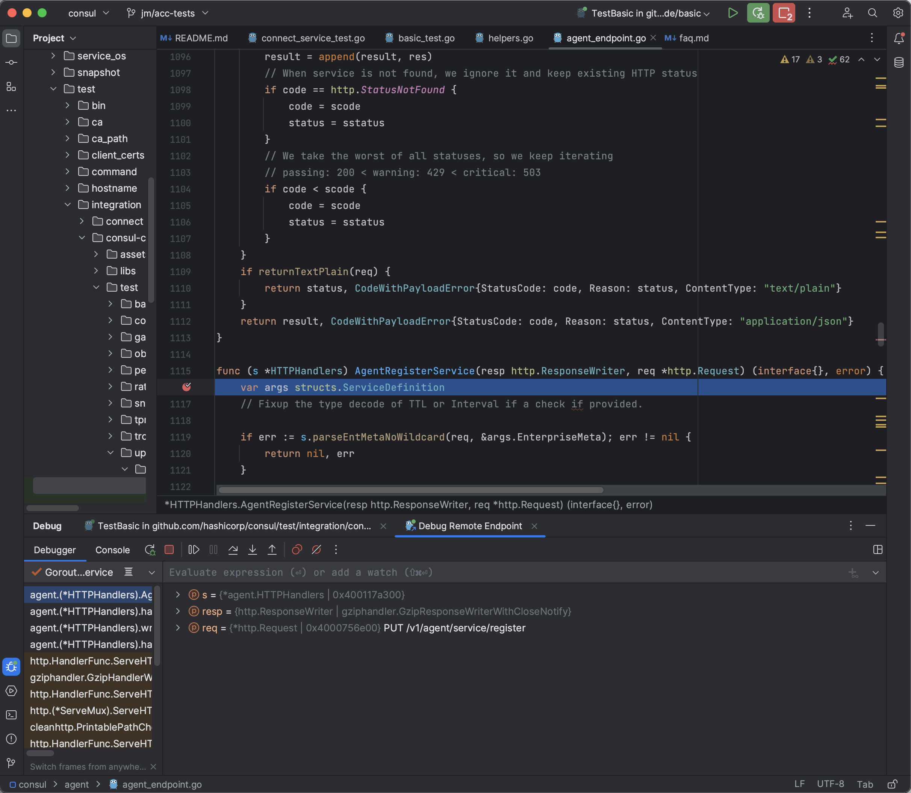

# Remote Debugging Integration Tests

- [Introduction](#introduction)
	- [How it works](#how-it-works)
- [Getting Started](#getting-started)
	- [Prerequisites](#prerequisites)
	- [Running Upgrade integration tests](#debugging-integration-tests)
      -  [Building images](#building-images)
	  -  [Remote debugging using GoLand](#remote-debugging-using-goland)


## Introduction

Remote debugging integration tests allows you to attach your debugger to the consul container and debug go code running on that container. 

### How it works
The `dev-docker-dbg` Make target will build consul docker container that has the following:
- [delve (dlv) debugger](https://github.com/go-delve/delve) installed.
- a port exposed on the container that allows a debugger from your development environment to connect and attach to the consul process and debug it remotely.
- logs out the host and port information so that you have the information needed to connect to the port.

The integration tests have been modified to expose the `--debug` flag that will switch the test from using a `consul:local` image that can be built using `make dev-docker` to using the `consul-dbg:local` image that was build from `make dev-docker-dbg`.

The test is run in debug mode with a breakpoint set to just after the cluster is created and you can retrieve the port information.  From there, you can set up a remote debugging session that connects to this port.

## Getting Started
### Prerequisites
To run/debug integration tests locally, the following tools are required on your machine:
- Install [Go](https://go.dev/) (the version should match that of our CI config's Go image).
- Install [`Makefile`](https://www.gnu.org/software/make/manual/make.html).
- Install [`Docker`](https://docs.docker.com/get-docker/) required to run tests locally.

### Debugging integration tests
#### Building images
- Build a consul image with dlv installed and a port exposed that the debugger can attach to.
  ```
  make dev-docker-dbg
  ```
- Build a consul-envoy container image from the consul root directory that is required for testing but not for debugging. 
  ```
  docker build consul-envoy:target-version --build-arg CONSUL_IMAGE=consul:local --build-arg ENVOY_VERSION=1.24.6 -f ./test/integration/consul-container/assets/Dockerfile-consul-envoy ./test/integration/consul-container/assets
  ```

#### Remote debugging using GoLand
(For additional information, see [GoLand's documentation on remote debugging](https://www.jetbrains.com/help/go/attach-to-running-go-processes-with-debugger.html#attach-to-a-process-on-a-remote-machine).)
##### Set up the Debug Configuration for your test
- Create the configuration for debugging the test. (You may have to debug the test once so GoLand creates the configuration for you.)
- Go to `Run > Edit Configurations` and select the appropriate configuration.
- Add `--debug` to `Program arguments` and click OK.

  
##### Obtain the debug port of your container
(This is required every time a test is debugged.)

- Put a breakpoint in the test that you are running right after the cluster has been created. This should be on the line after the call to `topology.NewCluster()`.
- Debug the test and wait for the debug session to stop on the breakpoint in the test.
- In the Debug window, search for `debug info` on the Console tab and note the host and port.

  
- Go to `Run > Edit Configurations` and add a `Go Remote` configuration with the host and port that your test has exposed.  Click OK.
  
  
- Debug the configuration that you just created.  Verify that it shows as connected in the `Debugger` of this configuration in the `Debug` window.
  
  
##### Debug the consul backend
- Set an appropriate breakpoint in the backend code of the endpoint that your test will call and that you wish to debug.
- Go to the test debugging tab for the integration test in the `Debug` window and `Resume Program`.
  
  
- The remote debugging session should stop on the breakpoint, and you can freely debug the code path.

  

#### Remote debugging using VSCode
(For additional information, see [VSCode's documentation on remote debugging](https://github.com/golang/vscode-go/blob/master/docs/debugging.md#remote-debugging).)

[comment]: <> (TODO: Openly looking for someone to add VSCode specific instructions.)