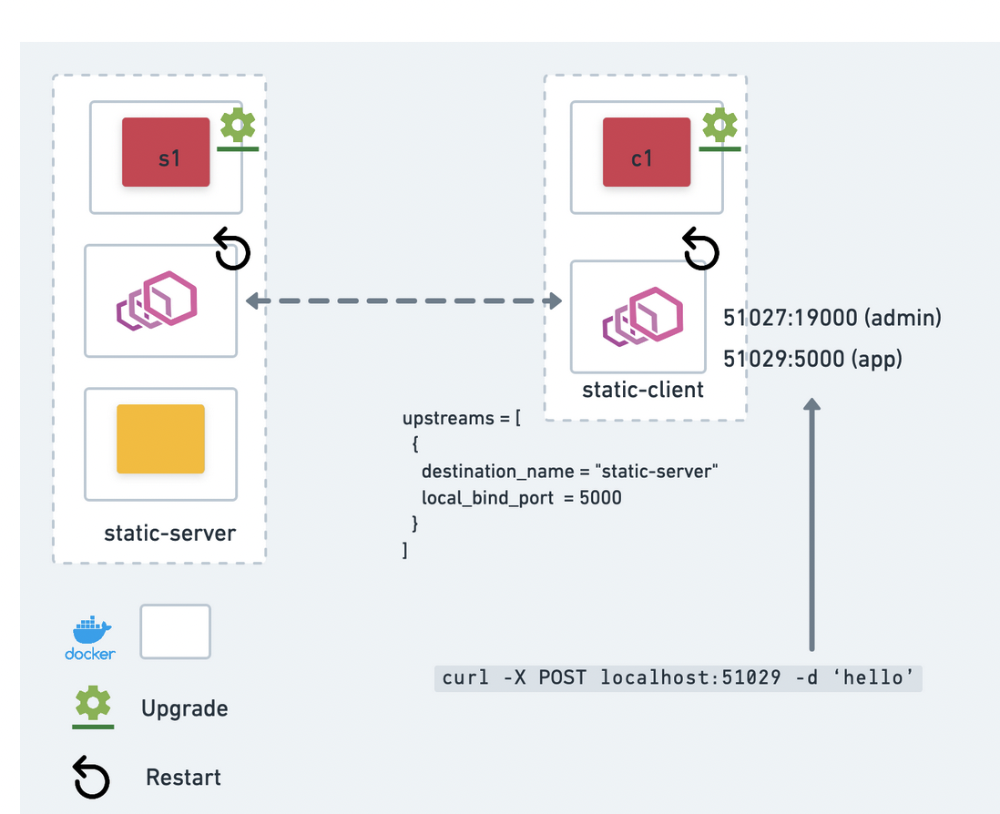

# Upgrade Integration Tests

- [Introduction](#introduction)
	- [How it works](#how-it-works)
- [Getting Started](#getting-started)
	- [Prerequisites](#prerequisites)
	- [Running Upgrade integration tests](#running-upgrade-integration-tests)
- [Adding a new upgrade integration test](#adding-a-new-upgrade-integration-test)
	- [Errors Test Cases](#errors-test-cases)
- [FAQS](#faqs)


## Introduction

The goal of upgrade tests is to ensure problem-free upgrades on supported upgrade paths. At any given time, Consul supports the latest minor release, and two older minor releases, e.g. 1.15, 1.14, and 1.13. Upgrades to any higher version are permitted, including skipping a minor version e.g. from 1.13 to 1.15.  

The upgrade tests also aims to highlight errors that may occur as users attempt to upgrade their current version to a newer version. 

### How it works

This diagram illustrates the deployment architecture of an upgrade test, where
two consul agents (one server and one client), a static-server, static-client,
and envoy sidecars are deployed.



> Note that all consul agents and user workloads such as application services, mesh-gateway are running in docker containers.

In general, each upgrade test has the following steps:
1. Create a cluster with a specified number of server and client agents, then enable the feature to be tested. 
2. Create some workload in the cluster, e.g., registering 2 services: static-server, static-client.
Static-server is a simple http application and the upstream service of static-client.
3. Make additional configuration to the cluster. For example, configure Consul intention to deny
connection between static client and server. Ensure that a connection cannot be made.
4. Upgrade Consul cluster to the `target-version` and restart the Envoy sidecars
(we restart Envoy sidecar to ensure the upgraded Consul binary can read the state from
the previous version and generate the correct Envoy configurations)
5. Re-validate the client, server and sidecars to ensure the persisted data from the previous
version can be accessed in the target version. Verify connection / disconnection
(e.g., deny Action)  

## Getting Started
### Prerequisites
To run the upgrade test, the following tools are required:
- install [Go](https://go.dev/) (the version should match that of our CI config's Go image).
- install [`golangci-lint`](https://golangci-lint.run/usage/install/) 
- install [`Makefile`](https://www.gnu.org/software/make/manual/make.html)
- [`Docker`](https://docs.docker.com/get-docker/) required to run tests locally  

### Running Upgrade integration tests
- run `make dev-docker`
- build a consul-envoy container image `cd test/integration/consul-container docker build -t consul-envoy:latest-version --build-arg CONSUL_IMAGE=docker.mirror.hashicorp.services/consul:1.15  --build-arg ENVOY_VERSION=1.24.6  -f ./assets/Dockerfile-consul-envoy ./assets`
- run the single test `go test -v -timeout 30m -run ^TestACL_Upgrade_Node_Token$ ./.../upgrade/`
- run all upgrade tests `go test -v -timeout 30m -run ./.../upgrade`

To specify targets and latest image pass `--target-version` and `--latest-version`
to the tests. By default, it uses the `consul` docker image with respectively
`local` and `latest` tags.

To use dev consul image, pass `target-image` and `target-version`:

    -target-image hashicorppreview/consul -target-version 1.15-dev

By default, all container's logs are written to either `stdout`, or `stderr`;
this makes it hard to debug, when the test case creates many containers. To
disable following container logs, run the test with `-follow-log false`.

Below are the supported CLI options
| Flags      | Default value | Description |
| -----------         | ----------- | ----------- |
| --latest-image      | `consul` in OSS, `hashicorp/consulenterprise` in ENT    | Name of the Docker image to deploy initially.
| --latest-version    | latest      | Tag of the Docker image to deploy initially.
| --target-image      | `consul` in OSS, `hashicorp/consulenterprise` in ENT    | Name of the Docker image to upgrade to.
| --target-version    | local     | Tag of the Docker image to upgrade to. `local` is the tag built by `make dev-docker` above.
| -follow-log         |  true    | Emit all container logs. These can be noisy, so we recommend `--follow-log=false` for local development.


## Adding a new upgrade integration test

All upgrade tests are defined in [test/integration/consul-container/test/upgrade](/test/integration/consul-container/test/upgrade) subdirectory.

Following is a guide for adding a new upgrade test case.
1. Create consul cluster(s) with a specified version. Some utility functions are provided to make
a single cluster or two peered clusters:

```go
	// NewCluster creates a single cluster
	cluster, _, _ := libtopology.NewCluster(t, &libtopology.ClusterConfig{
		NumServers: 1,
		NumClients: 1,
		BuildOpts: &libcluster.BuildOptions{
			Datacenter:           "dc1",
			ConsulVersion:        utils.LatestVersion,
		},
	})
```

Or

```go
	// BasicPeeringTwoClustersSetup creates two peered clusters, named accpeting and dialing
	accepting, dialing := libtopology.BasicPeeringTwoClustersSetup(t, utils.LatestVersion, false)
```

Some workloads may require extra resources. They should be created in this setup section. For example,
[https://github.com/hashicorp/consul-enterprise/blob/19e515db29541132dbbda73efb7a458cd29d705f/test/integration/consul-container/test/upgrade/peering_http_test.go#L30-L41](this peering test creates a second static-server).

2. Verify the workload

```go
	libassert.HTTPServiceEchoes(t, "localhost", port, "")
	libassert.AssertFortioName(t, fmt.Sprintf("http://localhost:%d", appPort), "static-server-2-v2", "")
```

3. Call the `StandardUpgrade` method and check that the upgrade succeeded.
We also restart the Envoy proxy to make sure the upgraded agent can generate
the correct Envoy configurations.

```go
	require.NoError(t, 
		cluster.StandardUpgrade(t, context.Background(), utils.TargetVersion))
	require.NoError(t, staticServerConnectProxy.Restart())
	require.NoError(t, staticClientConnectProxy.Restart())
```
4. Verify the workload from step 3 again

```go
	libassert.HTTPServiceEchoes(t, "localhost", port, "")
	libassert.AssertFortioName(t, fmt.Sprintf("http://localhost:%d", appPort), "static-server-2-v2", "")
```

For longer verifications, it can be nice to make a local function instead:
```go
	tests := func() {
		libassert.HTTPServiceEchoes(t, "localhost", port, "")
		libassert.AssertFortioName(t, fmt.Sprintf("http://localhost:%d", appPort), "static-server-2-v2", "")
	}
	tests()
	// ... do upgrade
	tests()
```

### Errors Test Cases
There are some caveats for special error handling of versions prior to `1.14`.   
Upgrade tests for features such as peering had API changes that return an error if an upgrade is attempted, and should be accounted for in upgrade tests. If running upgrade tests for any version before `1.14`, the following lines of code need to be added to skip it or it will not pass.  

```go
	fromVersion, err := version.NewVersion(utils.LatestVersion)
	require.NoError(t, err)
	if fromVersion.LessThan(utils.Version_1_14) {
		t.Skip("...")
	}
```
See example [here](https://github.com/hashicorp/consul-enterprise/blob/005a0a92c5f39804cef4ad5c4cd6fd3334b95aa2/test/integration/consul-container/test/upgrade/peering_control_plane_mgw_test.go#L92-L96)

To write tests for bugs found during upgrades, see example on how to add a testcase for those scenarios [here](./fullstopupgrade_test.go). 

## FAQS

**Q.** Are containers' ports (e.g., consul's 8500, envoy sidecar's admin port
or local upstream port) exposed on the docker host? \
**A.** Yes, they are exposed. However, they are exposed through a [pod container](https://github.com/hashicorp/consul/blob/57e034b74621180861226a01efeb3e9cedc74d3a/test/integration/consul-container/libs/cluster/container.go#L132).
That is, a consul agent and the envoy proxy containers registered with the agent
share the [same Linux network namespace (i.e., they share `localhost`)](https://github.com/hashicorp/consul/blob/57e034b74621180861226a01efeb3e9cedc74d3a/test/integration/consul-container/libs/cluster/app.go#L23-L30) as the pod container.
The pod container use the same prefix as the consul agent in its name.

**Q.** To troubleshoot, how can I send API request or consul command to the deployed cluster? \
**A.** To send an API request or command to the deployed cluster, ensure that a cluster,  services and sidecars have been created. See example below:
```go
	cluster, _, _ := topology.NewCluster()
	clientService := createServices(t, cluster)
	_, port := clientService.GetAddr()
	_, adminPort := clientService.GetAdminAddr()
    ...
    time.Sleep(900 * time.Second)
	fmt.Println(port, adminPort)
```
Then in your terminal `docker ps -a | grep consul` to get the running services and cluster. Exec in the cluster and run commands directly or make API request to `localhost:port` to relevant service or `localhost:adminPort` for envoy. 

**Q.** To troubleshoot, how can I access the envoy admin page? \
**A.** To access envoy admin page, ensure that a cluster, services and sidecars have been created. Then get the adminPort for the client or server sidecar. See example on how to get the port above. Then navigate to a browser and go to the url `http://localhost:adminPort/`  

**Q.** My test is stuck with the error "could not start or join all agents: container 0: port not found"? \
**A.** Simply re-run the tests. If the error persists, prune docker images `docker system prune`, run `make dev-docker`, then re-run tests again. 

**Q.** How to clean up the resources created the upgrade test?
**A.**  Run the command `docker ps | grep consul` to find all left over resources, then `docker stop {CONTAINER_ID} && docker rm {CONTAINER_ID}`
