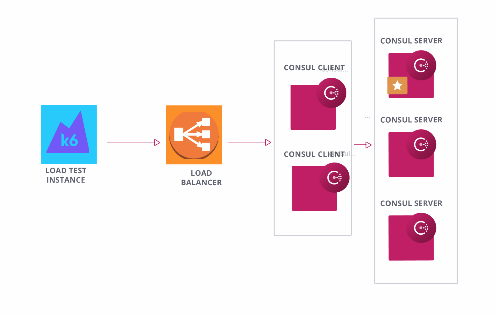

# Terraform Consul Load Testing
Consul Load Testing is used to capture baseline performance metrics for Consul under stress. This will assist in ensuring there are no performance regressions during releases and substantial changes to Consul. Per the defaults, the test runs for 10 minutes with 25 virtual users spawned by k6. Instance sizes for test instances are `t2.small` and for the Consul cluster `m5n.large`.  All metrics from Consul are pushed to a datadog dashboard for user review.
 
This relies on the [Gruntwork's Terraform AWS Consul Module](https://github.com/hashicorp/terraform-aws-consul) which *by default* creates 3 Consul servers across 3 availability zones. A load test instance which has an image that is configured with the necessary scripts and [k6](https://k6.io/) is created and sends traffic to a load balancer. The load balancer will distribute requests across the Consul clients who will ultimately forward the requests to the servers.
 

  
## How to use
[Terraform](https://www.terraform.io/downloads.html) and [Packer](https://www.packer.io/downloads), AWS and [Datadog](https://docs.datadoghq.com/getting_started/) are required to use this. All of this, except the AWS resources that will be utilized, are free.
 
This repo has the following folder structure:
* packer: This contains all the necessary stuff to make the load test and the Consul AMI to be utilized in Terraform.
* terraform: This contains all the relevant Terraform files
 
 
## Getting Started 
 
1) Download all necessary tools listed (Terraform, Packer)
2) Set up an [AWS account](https://aws.amazon.com/premiumsupport/knowledge-center/create-and-activate-aws-account/) and a [Datadog account](https://docs.datadoghq.com/getting_started/) - downloading the Datadog client is not necessary. 
3) Configure your AWS credentials using one of the [options supported by the AWS
  SDK](http://docs.aws.amazon.com/sdk-for-java/v1/developer-guide/credentials.html). Usually, the easiest option is to
  set the `AWS_ACCESS_KEY_ID`, `AWS_SECRET_ACCESS_KEY`, and `AWS_DEFAULT_REGION` environment variables.
4) Follow the [Packer README](./packer/README.md) to generate your load test and Consul AMIs
5) Follow the [Terraform README](./terraform/README.md) to stand up the infrastructure in AWS
6) Watch the results in either your datadog dashboard or in the output of your Terraform Apply

## Debugging in Datadog 
Consul has hundreds of metrics to choose from. We recommend reading over [Datadog's article](https://www.datadoghq.com/blog/consul-metrics/#communication-metrics) that breaks down relevant Consul metrics, especially on their "communication" portion. This test runs solely based on making requests to endpoints which is what makes that section so relevant.   
