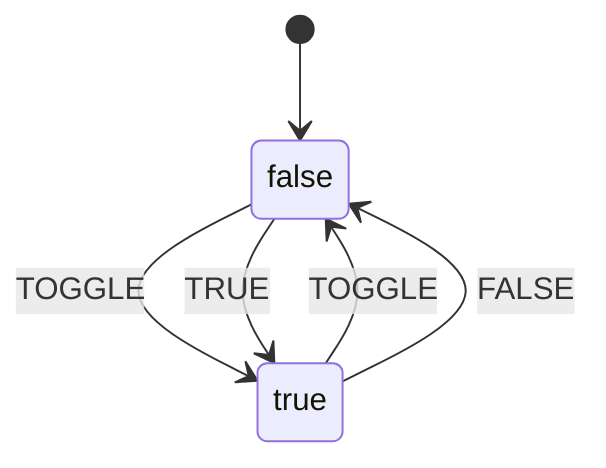
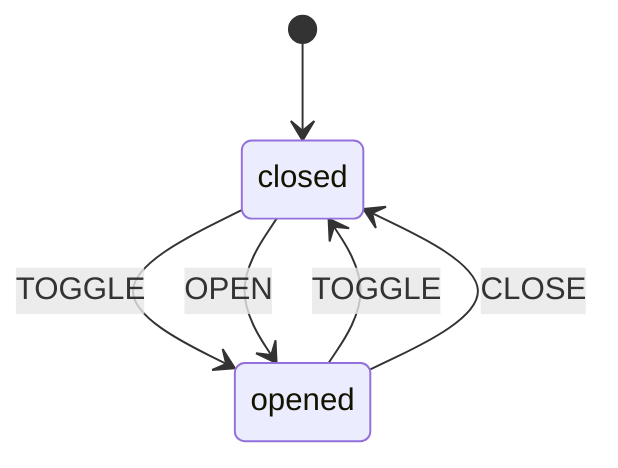

# Disclosure

A renderless component which can be used to implement an aria Disclosure pattern.

The disclosure exports an Action component already configured for use as a
clickable action. But if you want to contruct your own trigger, disclosure has
all the properties to enable you to do so.

You should make use of the `disclosure.Details` property in order control the
disclosure of the disclosure's content. By default it will automatically do
this for you. But if you need to control this yourself you can make use of the
`@auto` argument (see below for details).

You can use multiple `Details` components which lets you control multiple
areas with a single trigger/button.

Clicking outside will not close the disclosure by default, if you require this
functionality please combine with our `{{on-outside 'click'}}` modifier (see example).

By default, there are no aria attributes that you need to add or think about
as a consumer of the component, but you **should** make use of the
`details.id` property to set the `id=""` on the DOM element you are
disclosing. Every `Details` component has its `id` added to the `Action`
`aria-controls` attribute by default so you don't need to do this yourself if
using the `Details` component.

```hbs preview-template
<Disclosure as |disclosure|>
  <disclosure.Action
    {{on-outside 'click' disclosure.close}}
    {{on 'click' disclosure.toggle}}
  >
    {{if disclosure.expanded "Close" "Open"}}
  </disclosure.Action>
  <disclosure.Details as |details|>
    <p
      id={{details.id}}
    >
      Disclose Me!
    </p>
  </disclosure.Details>
</Disclosure>
```

You can also use multiple Details components for a single Discloure Action component to control multiple areas.

```hbs preview-template
<Disclosure as |disclosure|>
  <disclosure.Action
    {{on-outside 'click' disclosure.close}}
    {{on 'click' disclosure.toggle}}
  >
    {{if disclosure.expanded "Close" "Open"}}
  </disclosure.Action>
  <disclosure.Details as |details|>
    <p
      id={{details.id}}
    >
      Disclose Me!
    </p>
  </disclosure.Details>
  <disclosure.Details as |details|>
    <p
      id={{details.id}}
    >
      Disclose Me also!
    </p>
  </disclosure.Details>
</Disclosure>
```

Or use two buttons/Actions to control one Detail (or multiple Details).

```hbs preview-template
<Disclosure as |disclosure|>
  <div
    {{on-outside 'click' disclosure.close}}
  >
    <disclosure.Action
      {{on 'click' disclosure.toggle}}
    >
      {{if disclosure.expanded "1 Close" "1 Open"}}
    </disclosure.Action>
    <disclosure.Action
      {{on 'click' disclosure.toggle}}
    >
      {{if disclosure.expanded "2 Close" "2 Open"}}
    </disclosure.Action>
    <disclosure.Details as |details|>
      <p
        id={{details.id}}
      >
        Disclose Me!
      </p>
    </disclosure.Details>
  </div>
</Disclosure>
```

If you don't want to use the automatic hiding/showing (and therefore removal from the DOM) of the Details component, you can pass a `@auto={{false}}` argument to the Details component, which allows you to either specify a Handlebars conditional yourself or use CSS to hide/show the content to be disclosed.

**Please note:** We use a `style` attribute here just for illustrative purposes, you should consider using a `class` attribute instead if you want to use CSS for disclosure.

```hbs preview-template
<Disclosure as |disclosure|>
  <disclosure.Action
    {{on-outside 'click' disclosure.close}}
    {{on 'click' disclosure.toggle}}
  >
    {{if disclosure.expanded "Close" "Open"}}
  </disclosure.Action>
  <disclosure.Details
    @auto={{false}}
  as |details|>
    {{#if details.expanded}}
      <p
        id={{details.id}}
      >
        Disclose Me with a hbs conditional!
      </p>
    {{/if}}
  </disclosure.Details>
  <disclosure.Details
    @auto={{false}}
  as |details|>
      <p
        id={{details.id}}
        aria-hidden={{if (not details.expanded) 'false'}}
        style={{style-map
          (array 'display' (if (not details.expanded) 'none'))
        }}
      >
        Disclose Me via CSS!
      </p>
  </disclosure.Details>
</Disclosure>
```

By making use of `@auto={{false}}` and hand-rolling your show/hide logic you
can use disclosure to implement slightly more complex UI.

```hbs preview-template
<Disclosure as |disclosure|>
  <disclosure.Action
    {{on-outside 'click' disclosure.close}}
    {{on 'click' disclosure.toggle}}
  >
    {{if disclosure.expanded "Close" "Open"}}
  </disclosure.Action>
  <disclosure.Details
  as |details|>
      <p
        id={{details.id}}
      >
        Disclose Me!
      </p>
  </disclosure.Details>
  <disclosure.Details
    @auto={{false}}
  as |details|>
    {{#if (not details.expanded)}}
      <p
        id={{details.id}}
      >
        Disclose Me by default but hide when the other details is disclosed!
      </p>
    {{/if}}
  </disclosure.Details>
</Disclosure>
```

## Arguments

| Argument | Type | Default | Description |
| --- | --- | --- | --- |
| `expanded` | `Boolean` | false | The _initial_ state of the disclosure. Please note: this is the _initial_ state only, please use the `disclosure.open` and `disclosure.close` for controling the state. |

## Exported API

| Name | Type | Description |
| --- | --- | --- |
| `Action` | `GlimmerComponent` | A contextual '<Action />' component with aria attributes correctly applied, please note you still need to add an 'on' modifier here so you can control whether it opens on click/hover etc |
| `Details` | `GlimmerComponent` | A contextual '<Action />' component with aria attributes correctly applied, please note you still need to add an 'on' modifier here so you can control whether it opens on click/hover etc |
| `open` | `Function` | Open the disclosure if its not already open |
| `close` | `Function` | Close the disclosure if its not already closed |
| `toggle` | `Function` | Toggle the open/close state of the disclosure |
| `expanded` | `Boolean` | Whether the disclosure is 'expanded' or not |
| `event` | `Boolean` | The event used to change the state of the disclosure |
| `button` | `string` | A unique id reference to reference the an Action with if required for a11y reasons |
| `controls` | `string` | An id to use on the panel for the disclosure |


### disclosure.Action

An `<Action />` component with the correct aria attributes added.

### disclosure.Details

#### Arguments

| Argument | Type | Default | Description |
| --- | --- | --- | --- |
| `auto` | `Boolean` | true | Whether to automatically control the disclosure of the details component. Set to false to control this yourself. Please be aware of using `aria-hidden` if using CSS to control the visibility of disclosure (see examples above). |

#### Exported API

| Name | Type | Description |
| --- | --- | --- |
| `id` | `String` | A unique id which you **should** (for aria reasons) use for the root DOM element you are controlling with the disclosure |
| `expanded` | `Boolean` | An alias of `disclosure.expanded`. Whether the disclosure is 'expanded' or not. If disclosure of the `Details` is controlled via CSS you **should** use this to set/unset `aria-hidden` |

## Internal States

Opened and closed states of the Disclosure are managed internally by a simple boolean state machine:



which in the context of the Disclosure component is better represented via:



## See

- [Component Source Code](./index.js)
- [Template Source Code](./index.hbs)

---
