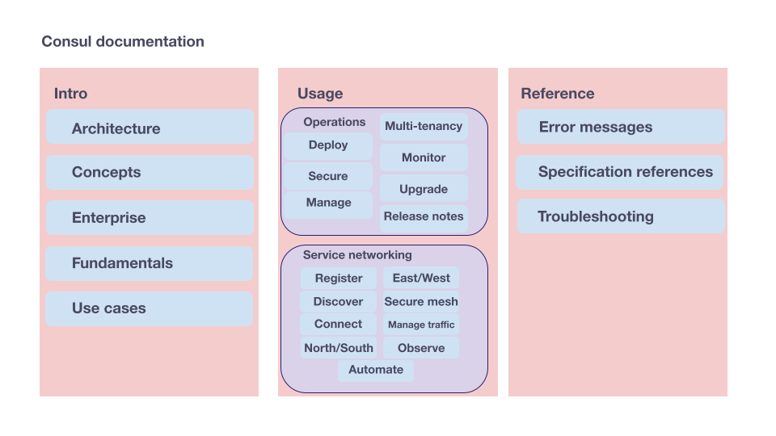

# Information architecture and content strategy for Consul documentation

The `website/content` directory in the `hashicorp/consul` repository contains [the Consul documentation on developer.hashicorp.com](https://developer.hashicorp.com/consul). This `README` describes the directory structure and design principles for this documentation set.

`README` table of contents:

- [Content directory overview](#content-directory-overview)
- [North star principles for content design](#north-star-principles)
- [Consul content strategy](#content-strategy), including user persona and jobs-to-be-done
- [Consul taxonomy](#taxonomy)
- [Path syntax](#path-syntax) for directory name and nesting guidelines
- [Controlled vocabularies](#controlled-vocabularies) for Consul terms and labeling standards
- [Guide to partials](#guide-to-partials)
- [How to document new Consul features](#how-to-document-new-consul-features)
- [Maintaining and deprecating content](#maintaining-and-deprecating-content)

To update the contents of this document, create a PR against the `main` branch of the `hashicorp/consul` GitHub repository. Apply the label `type/docs` to the PR to request review from an approver in the `consul-docs` group.

## Content directory overview

The `website/content` directory in the `hashicorp/consul` GitHub repo contains the following sub-directories:

```
.
├── api-docs
├── commands
├── docs
└── partials
```

After you merge a PR into a numbered release branch, changes to these folders appear at the following URLs:

- Changes to `api-docs` appear at [https://developer.hashicorp.com/consul/api-docs](https://developer.hashicorp.com/consul/api-docs).
- Changes to `commands` appear at [https://developer.hashicorp.com/consul/commands](https://developer.hashicorp.com/consul/commands).
- Changes to `docs` appear at [https://developer.hashicorp.com/consul/docs](https://developer.hashicorp.com/consul/docs).

URLs follow the directory structure for each file and omit the the `.mdx` file extension. Pages named `index.mdx` adopt their directory's name. For example, the file `docs/reference/agent/configuration-file/index.mdx` appears at the URL [https://developer.hashicorp.com/consul/docs/reference/agent/configuration-file](https://developer.hashicorp.com/consul/docs/reference/agent/configuration-file).

The `partials` folder includes content that you can reuse across pages in any of the three folders. Refer to [Guide to Partials](#guide-to-partials) for more information.

Tutorials that appear at [https://developer.hashicorp.com/consul/tutorials](https://developer.hashicorp.com/consul/tutorials) are located in a different repository. This content exists in the [hashicorp/tutorials GitHub repo](https://github.com/hashicorp/tutorials), which is internal to the HashiCorp organization.

### Other directories of note

The `website/data` directory contains `.json` files that populate the navigation sidebar on [developer.hashicorp.com](https://developer.hashicorp.com).

The `website/public/img` directory contains the images used in the documentation.

Instructions on editing these files, including instructions on running local builds of the documentation, are in the `README` for the `website` directory, one level above this one.

## North Star principles

The design of the content in the `docs/` directory, including structure, file paths, and labels, is governed by the following _north star principles_.

1. **Users are humans**. Design for humans first. For example, file paths become URLs; create human-readable descriptions of the content and avoid unnecessary repetition.
1. **Less is always more**. Prefer single words for folder and file names; add a hyphen and a second word to disambiguate from existing content.
1. **Document what currently exists**. Do not create speculative folders and files to "reserve space" for future updates and releases. Do not describe Consul as it will exist in the future; describe it as it exists right now, in the latest release.
1. **Beauty works better**. When creating new files and directories, strive for consistency with the existing structure. For example, use parallel structures across directories and flatten directories that run too deep. Tip: If it doesn't look right, it's probably not right.
1. **Prefer partials over `ctrl+v`**. Spread content out, but document unique information in one place. When you need to repeat content across multiple pages, use partials to maintain content.

These principles exist to help you navigate ambiguity when making changes to the underlying content. If you add new content and you're not quite sure where to place it or how to name it, use these "north stars" to help you make an informed decision about what to do.

Over time, Consul may change in ways that require significant edits to this information architecture. The IA and content strategy were designed with this possibility in mind. Use these north star principles to help you make informed (and preferably incremental) changes over time.

## Content strategy

Consul's content strategy centers on three main considerations:

- **User persona** considers the roles of Consul users in DevOps workflows, which may be either broad or narrowly defined.
- **Jobs-to-be-done** includes the practical outcomes users want to achieve when using Consul to address a latent concern.
- **Content type** asks what kind of content exists on the page, and follows the principles of Diataxis.

You should keep all three of the considerations in mind when creating new content or updating existing content in the documentation and tutorials. Ask yourself the following questions to help you determine your content needs:

- Who will use this documentation?
- What concerns will that person have?
- What goals are they trying to accomplish?
- What kind of content would help the user achieve their goal?

For more information about recommended workflow patterns, refer to [How to document new Consul features](#how-to-document-new-consul-features) and [Maintaining and deprecating content](#maintaining-and-deprecating-content).

### User personas, jobs-to-be-done, and critical user journeys

Consul is a flexible service networking tool, with applications across DevOps workflows. The following table lists Consul's user personas, examples of their major concerns, and typical jobs that this user wants to complete using Consul's features.

| User persona          | Jobs-to-be-done                                                                                                                                                                                                      | Critical user journeys                                                                                                                                                                                                                                                                                                                                                                                                                                                                                                                                                                         |
| :-------------------- | :------------------------------------------------------------------------------------------------------------------------------------------------------------------------------------------------------------------- | :--------------------------------------------------------------------------------------------------------------------------------------------------------------------------------------------------------------------------------------------------------------------------------------------------------------------------------------------------------------------------------------------------------------------------------------------------------------------------------------------------------------------------------------------------------------------------------------------- |
| Application developer | &#8226; Application is discoverable across on-prem and cloud environments.<br />&#8226; Applications can reliably find and connect to dependent upstream services.                                                   | &#8226; I want to use Consul to register the locations of my applications across infrastructure environments so that they can be discovered by downstream applications.<br />&#8226; I want to define intelligent failover policies for my applications so that my services are highly available and fault tolerant.<br />&#8226; I want to use Consul's service catalog find and connect to healthy upstream services across multiple clouds and runtime environments.                                                                                                                        |
| Platform engineer     | &#8226; Architect global service registry that makes services avilable regardless of infrastructure. <br />&#8226; Reliability and availability of the service registry so that I can meet service level objectives. | &#8226; I want to implement monitoring and alerting for Consul in order to quickly identify and resolve cluster instability, or service connectivity issues.<br />&#8226; I want to automate recovery procedures and ensure resilience in order to meet SLO and SLA objectives.<br />&#8226; I want to interconnect Consul clusters to enable unified service discovery across cloud and on-premises environments.<br />&#8226;I want to provide guidance and guardrails for enabling application developers to register services into Consul, and ensure their services are highly available. |
| Security engineer     | &#8226; Ensure that critical infrastructure and services adhere to corporate security policies.                                                                                                                      | &#8226; I want to ensure that communication between critical infrastructure services is encrypted in transit, and access to systems is appropriately controlled and audited.<br />&#8226; I want to integrate Consul authentication with existing corporate identity and access management (IAM) systems.<br />&#8226; I want to ensure that users have least privileged, but sufficient access to Consul for managing and discovering services.                                                                                                                                               |

### Content types

The content we create and host on developer.hashicorp.com follows the principles of the [Diátaxis method for structured documentation](https://diataxis.fr/), which use the following basic content types:

- Explanation
- Usage
- Reference
- Tutorials

Because tutorials are hosted in a separate repository, this README focuses on the first three content types.

Within the "Explanation" category, we use three different types of pages, each of which has a distinct purpose.

- **Index** pages provide lists of links to supporting documentation on a subject. [Example: Deploy Consul](https://developer.hashicorp.com/consul/docs/deploy)
- **Overview** pages provide an introduction to a subject and serve as a central information point. [Example: Expand service network east/west](https://developer.hashicorp.com/consul/docs/east-west)
- **Concept** pages provide discursive explanations of Consul's underlying systems and their operations. [Example: Consul catalog](https://developer.hashicorp.com/consul/docs/concept/catalog)

## Taxonomy

There are three main categories in the Consul docs information architecture. This division of categories is _not literal_ to the directory structure, even though the **Reference** category includes the repository's `reference` folder.

- Intro
- Usage
- Reference

These categories intentionally align with [Diataxis](https://diataxis.fr/).

The following diagram summarizes the taxonomy of the Consul documentation:



In this image, the blue boxes represent literal directories. The salmon and purple boxes around them are figurative categories that are not literally represented in the file structure.

### Intro

The **Intro** category includes the following folders in `website/content/docs/`:

- `architecture`
- `concept`
- `enterprise`
- `fundamentals`
- `use-case`

The following table lists each term and a definition to help you decide where to place new content.

| Term         | Directory      | What it includes                                                                                                                                                 |
| :----------- | :------------- | :--------------------------------------------------------------------------------------------------------------------------------------------------------------- |
| Architecture | `architecture` | The product's components and their “maps” in cloud networking contexts.                                                                                          |
| Concepts     | `concept`      | Describes the complex behavior of technical systems in a non-literal manner. For example, computers do not literally “gossip” when they use the gossip protocol. |
| Enterprise   | `enterprise`   | Consul Enterprise license offerings and how to implement them.                                                                                                   |
| Fundamentals | `fundamentals` | The knowledge, connection and authorization methods, interactions, configurations, and operations most users require to use the product.                         |
| Use cases    | `use-case`     | The highest level goals practitioners have; a product function that “solves” enterprise concerns and usually competes with other products.                       |

#### User persona indexed to intro topic

This table indexes each intro directory and its contents with the typical concerns of the user persona based on their jobs-to-be-done and critical user journeys:

| Intro topic  | Platform engineer | Security engineer | Application developer |
| :----------- | :---------------: | :---------------: | :-------------------: |
| Architecture |      &#9989;      |      &#9989;      |       &#10060;        |
| Concepts     |      &#9989;      |      &#9989;      |        &#9989;        |
| Enterprise   |      &#9989;      |     &#10060;      |       &#10060;        |
| Fundamentals |      &#9989;      |      &#9989;      |        &#9989;        |
| Use cases    |      &#9989;      |      &#9989;      |        &#9989;        |

The purpose of this table is to validate the relationship between the information architecture and the content strategy by indexing them to one another. Potential applications for this table include curricular learning paths and targeted content expansion.

### Usage

The **Usage** category includes the following folders in `website/content/docs/`:

- `automate`
- `connect`
- `deploy`
- `discover`
- `east-west`
- `envoy-extension`
- `integrate`
- `manage`
- `manage-traffic`
- `monitor`
- `multi-tenant`
- `north-south`
- `observe`
- `register`
- `release-notes`
- `secure`
- `secure-mesh`
- `upgrade`

These folders are organized into two groups that are _not literal_ to the directory structure, but are reflected in the navigation bar.

- **Operations**. User actions, workflows, and goals related to installing and operating Consul as a long-running daemon on multiple nodes in a network.
- **Service networking**. User actions, workflows, and goals related to networking solutions for application workloads.

Each folder is named after a corresponding _phase_, which have a set order in the group.

#### Operations

Operations consists of the following phases, intentionally ordered to reflect the full lifecycle of a Consul agent.

| Phase                | Directory       | Description                                                                                                                                               |
| :------------------- | :-------------- | :-------------------------------------------------------------------------------------------------------------------------------------------------------- |
| Deploy Consul        | `deploy`        | The processes to install and start Consul server agents, client agents, and dataplanes.                                                                   |
| Secure Consul        | `secure`        | The processes to set up and maintain secure communications with Consul agents, including ACLs, TLS, and gossip.                                           |
| Manage multi-tenancy | `multi-tenant`  | The processes to use one Consul datacenter for multiple tenants, including admin partitions, namespaces, network segments, and sameness groups.           |
| Manage Consul        | `manage`        | The processes to manage and customize Consul's behavior, including DNS forwarding on nodes, server disaster recovery, rate limiting, and scaling options. |
| Monitor Consul       | `monitor`       | The processes to export Consul logs and telemetry for insight into agent behavior.                                                                        |
| Upgrade Consul       | `upgrade`       | The processes to update the Consul version running in datacenters.                                                                                        |
| Release Notes        | `release-notes` | Describes new, changed, and deprecated features for each release of Consul and major associated binaries.                                                 |

#### Service networking

Service Networking consists of the following phases, intentionally ordered to reflect a recommended “order of operations.” Although these phases do not need to be completed in order, their order reflects a general path for increasing complexity in Consul’s service networking capabilities as you develop your network.

| Phase                  | Directory        | Description                                                                                                                              |
| :--------------------- | :--------------- | :--------------------------------------------------------------------------------------------------------------------------------------- |
| Register services      | `register`       | How to define services and health checks and then register them with Consul.                                                             |
| Discover services      | `discover`       | How to use Consul's service discovery features, including Consul DNS, service lookups, load balancing.                                   |
| Connect service mesh   | `connect`        | How to set up and use sidecar proxies in a Consul service mesh.                                                                          |
| Secure north/south     | `north-south`    | How to configure, deploy, and use the Consul API gateway to secure network ingress.                                                      |
| Expand east/west       | `east-west`      | How to connect Consul datacenters across regions, runtimes, and providers with WAN federation and cluster peering.                       |
| Secure mesh traffic    | `secure-mesh`    | How to secure service-to-service communication with service intentions and TLS certificates.                                             |
| Manage service traffic | `manage-traffic` | How to route traffic between services in a service mesh, including service failover and progressive rollouts.                            |
| Observe service mesh   | `observe`        | How to observe service mesh telemetry and application performance, including Grafana.                                                    |
| Automate applications  | `automate`       | How to automate Consul and applications to update dynamically, including the KV store, Consul-Terraform-Sync (CTS), and Consul template. |

#### User persona indexed to usage phase

This table indexes each usage directory and its contents with the typical concerns of the user persona based on their jobs-to-be-done and critical user journeys:

| Usage phase            | Platform engineer | Security engineer | Application developer |
| :--------------------- | :---------------: | :---------------: | :-------------------: |
| Deploy Consul          |      &#9989;      |      &#9989;      |       &#10060;        |
| Secure Consul          |      &#9989;      |      &#9989;      |       &#10060;        |
| Manage multi-tenancy   |      &#9989;      |      &#9989;      |       &#10060;        |
| Manage Consul          |      &#9989;      |     &#10060;      |       &#10060;        |
| Monitor Consul         |      &#9989;      |      &#9989;      |       &#10060;        |
| Upgrade Consul         |      &#9989;      |     &#10060;      |       &#10060;        |
| Release Notes          |      &#9989;      |     &#10060;      |       &#10060;        |
| Register services      |      &#9989;      |     &#10060;      |        &#9989;        |
| Discover services      |      &#9989;      |     &#10060;      |        &#9989;        |
| Connect service mesh   |      &#9989;      |     &#10060;      |       &#10060;        |
| Secure north/south     |      &#9989;      |      &#9989;      |       &#10060;        |
| Expand east/west       |      &#9989;      |      &#9989;      |       &#10060;        |
| Secure mesh traffic    |      &#9989;      |      &#9989;      |       &#10060;        |
| Manage service traffic |      &#9989;      |     &#10060;      |       &#10060;        |
| Observe service mesh   |      &#9989;      |     &#10060;      |       &#10060;        |
| Automate applications  |      &#9989;      |     &#10060;      |        &#9989;        |

The purpose of this table is to validate the relationship between the information architecture and the content strategy by indexing them to one another. Potential applications for this table include curricular learning paths and targeted content expansion.

### Reference

The **Reference** category includes the following folders in `website/content/docs/`:

- `error-messages`
- `reference`
- `troubleshoot`

The following table lists each term and a definition to help you decide where to place new content.

| Term           | Directory         | What it includes                                                                                     |
| :------------- | :---------------- | :--------------------------------------------------------------------------------------------------- |
| Error Messages | `error-messsages` | Error messages and their causes, organized by runtime and Consul release binary.                     |
| Reference      | `reference`       | All reference information for configuring Consul, its components, and the infrastructure it runs on. |
| Troubleshoot   | `troubleshoot`    | Instructions and guidance about how to figure out what's wrong with a Consul deployment.             |

### User persona indexed to reference subject

This table indexes each reference and its contents with the typical concerns of the user persona based on their jobs-to-be-done and critical user journeys.

| Reference subject        | Platform engineer | Security engineer | Application developer |
| :----------------------- | :---------------: | :---------------: | :-------------------: |
| Error messages           |      &#9989;      |     &#10060;      |       &#10060;        |
| Reference specifications |      &#9989;      |      &#9989;      |        &#9989;        |
| Troubleshoot             |      &#9989;      |     &#10060;      |        &#9989;        |

The purpose of this table is to validate the relationship between the information architecture and the content strategy by indexing them to one another. Potential applications for this table include curricular learning paths and targeted content expansion.

## Path syntax

A major advantage of this information architecture is the filepath structure. This structure "tags" documentation with keywords that describe the page's content to optimize the documentation for Google SEO while also helping human users build a "mental model" of Consul.

Our syntax creates human-readable names for file paths using a controlled vocabulary and intentional permutations. In general, the syntax follows a repeating pattern of `Verb / Noun / Adjective` to describe increasingly specific content and user goals.

For **Consul operations**, filepaths assume the following syntax:

<CodeBlockConfig hideClipboard>

```plaintext
Phase / Component / Runtime / Action / Provider
```

</CodeBlockConfig>

Examples:

- `secure/encryption/tls/rotate/vm` contains instructions for rotating TLS certificates Consul agents use to secure their communications when running on virtual machines.
- `deploy/server/k8s/platform/openshift` contains instructions on deploying a Consul server agent when running OpenShift.
- `upgrade/k8s/compatibility` contains information about compatible software versions to help you upgrade the version of Consul running on Kubernetes.

For **service networking**, filepaths tend to have the following order:

<CodeBlockConfig hideClipboard>

```plaintext
Phase / Feature / Action / Runtime / Interface
```

</CodeBlockConfig>

Examples:

- `discover/load-balancer/nginx` contains instructions for using NGINX as a load balancer based on Consul service discovery results.
- `east-west/cluster-peering/establish/k8s` contains instructions for creating new connections between Consul clusters running on Kubernetes in different regions or cloud providers.
- `register/service/k8s/external` contains information about how to register services running on external nodes to Consul on Kubernetes by configuring them to join the Consul datacenter.
- `register/external/esm/k8s` contains information about registering services running on external nodes to Consul on Kubernetes using the External Services Manager (ESM).

## Controlled vocabularies

This section lists the standard names for files and directories, divided into sub-groups based on the syntax guide in this `README`. The following list provides links to specific vocabulary groups:

- [Architecture vocabulary](#architecture-vocabulary)
- [Concepts vocabulary](#concepts-vocabulary)
- [Use case vocabulary](#use-case-vocabulary)
- [Components vocabulary](#components-vocabulary)
- [Features vocabulary](#features-vocabulary)
- [Runtimes vocabularly](#runtimes-vocabulary)
- [Actions vocabulary](#actions-vocabulary)
- [Providers vocabulary](#providers-vocabulary)
- [Interfaces vocabulary](#interfaces-vocabulary)
- [Configuration entry vocabulary](#configuration-entry-vocabulary)
- [Envoy extension vocabulary](#envoy-extension-vocabulary)

### Architecture vocabulary

Consul's _architecture_ vocabulary is structured according to where components run:

- `control-plane`: The _control plane_ is the network infrastructure that maintains a central registry to track services and their respective IP addresses. Both server and client agents operate as part of the control plane. Consul dataplanes, despite the name, are also part of the Consul control plane.
- `data-plane`: Use two words, _data plane_, to refer to the application layer and components involved in service-to-service communication.

Common architecture terms and where they run:

| Control plane  | Data plane |
| :------------- | :--------- |
| `agent`        | `gateway`  |
| `server agent` | `mesh`     |
| `client agent` | `proxy`    |
| `dataplane`    | `service`  |

The **Reference** category also includes an `architecture` sub-directory. This "Reference architecture" includes information such as port requirements, server requirements, and AWS ECS architecture.

### Concepts vocabulary

Consul's _concepts_ vocabulary collects terms that describe how internal systems operate through human actions.

| Concept                     | Label         | Description                                                                                       |
| :-------------------------- | :------------ | :------------------------------------------------------------------------------------------------ |
| Consul catalog              | `catalog`     | Covers Consul's running service registry, which includes node addresses and health check results. |
| Consensus protocol (Raft)   | `consensus`   | Covers the server agent elections governed by the Raft protocol.                                  |
| Cluster consistency         | `consistency` | Covers Consul's anti-entropy features, consistency modes, and Jepsen testing.                     |
| Gossip communication (Serf) | `gossip`      | Covers Serf communication between Consul agents in a datacenter.                                  |
| Datacenter reliability      | `reliability` | Covers fault tolerance, quorum size, and server redundancy.                                       |

### Use case vocabulary

Consul's _use case_ vocabulary collects terms that describe the highest-level goals users have that would lead them to choose Consul as their networking solution.

| Use case                          | Label               |
| :-------------------------------- | :------------------ |
| Service discovery                 | `service-discovery` |
| Service mesh                      | `service-mesh`      |
| API gateway security              | `api-gateway`       |
| Configuration management tooling  | `config-management` |
| Domain Name Service (DNS) tooling | `dns`               |

### Components vocabulary

Consul's _components_ vocabulary collects terms that describe Consul's built-in components, enterprise offerings, and other offerings that impact the operations of Consul agent clusters.

| Component                    | Label               |
| :--------------------------- | :------------------ |
| Access Control List (ACL)    | `acl`               |
| Admin partition              | `admin-partition`   |
| Audit logs                   | `audit-log`         |
| Automated backups            | `automated-backup`  |
| Automated upgrades           | `automated-upgrade` |
| Auth methods                 | `auth-method`       |
| Cloud auto-join              | `cloud-auto-join`   |
| Consul-Terraform-Sync        | `cts`               |
| DNS                          | `dns`               |
| FIPS                         | `fips`              |
| JSON Web Token Authorization | `jwt-auth`          |
| Consul Enterprise License    | `license`           |
| Long term support (LTS)      | `lts`               |
| Namespaces                   | `namespace`         |
| Network areas                | `network-area`      |
| Network segments             | `network-segment`   |
| OIDC Authorization           | `oidc-auth`         |
| Agent rate limits            | `rate-limit`        |
| Read repilicas               | `read-replica`      |
| Redundancy zones             | `redundancy-zone`   |
| Sentinel policies            | `sentinel`          |
| Agent snapshots              | `snapshot`          |
| Single sign on (SSO)         | `sso`               |

### Features vocabulary

Consul's _features_ vocabulary collects terms that describe Consul product offerings related to service networking for application workloads.

| Feature                                           | Label                  |
| :------------------------------------------------ | :--------------------- |
| Cluster peering                                   | `cluster-peering`      |
| Consul template                                   | `consul-template`      |
| Consul DNS                                        | `dns`                  |
| Discovery chain                                   | `discovery-chain`      |
| Distributed tracing                               | `distributed-tracing`  |
| External services manager (ESM)                   | `esm`                  |
| Failover                                          | `failover`             |
| Health checks                                     | `health-check`         |
| Service intentions                                | `intention`            |
| Ingress gateway (deprecated)                      | `ingress-gateway`      |
| Key/value store                                   | `kv`                   |
| Load balancing                                    | `load-balancer`        |
| Logs                                              | `log`                  |
| Mesh gateways                                     | `mesh-gateway`         |
| Mutual Transport Layer Security (mTLS) encryption | `mtls`                 |
| Prepared queries (dynamic service lookup)         | `dynamic`              |
| Progressive application rollouts                  | `progressive-rollouts` |
| Services                                          | `service`              |
| Sessions                                          | `session`              |
| Static DNS queries (static service lookup)        | `static`               |
| Service mesh telemetry                            | `telemetry`            |
| Transparent proxy                                 | `transparent-proxy`    |
| Virtual services                                  | `virtual-service`      |
| Consul DNS views                                  | `views`                |
| Wide area network (WAN) federation                | `wan-federation`       |
| Watches                                           | `watch`                |

### Runtimes vocabulary

Consul's _runtimes_ vocabulary collects the underlying runtimes where Consul supports operations.

| Runtimes                 | Label    |
| :----------------------- | :------- |
| Virtual machines (VMs)   | `vm`     |
| Kubernetes               | `k8s`    |
| Nomad                    | `nomad`  |
| Docker                   | `docker` |
| HashiCorp Cloud Platform | `hcp`    |

#### Provider-specific runtimes

This sub-group includes provider-specific runtimes, such as EKS and AKS.

| Provider-specific runtimes           | Label       |
| :----------------------------------- | :---------- |
| AWS Elastic Container Service (ECS)  | `ecs`       |
| AWS Elastic Kubernetes Service (EKS) | `eks`       |
| AWS Lambda (serverless)              | `lambda`    |
| Azure Kubernetes Service (AKS)       | `aks`       |
| Google Kubernetes Service (GKS)      | `gks`       |
| OpenShift                            | `openshift` |
| Argo                                 | `argo`      |

### Actions vocabulary

Consul's _actions_ vocabulary collects the actions user take to operate Consul and enact service networking states.

| Action                     | Label            |
| :------------------------- | :--------------- |
| Backup and restore         | `backup-restore` |
| Bootstrap                  | `bootstrap`      |
| Configure                  | `configure`      |
| Deploy                     | `deploy`         |
| Enable                     | `enable`         |
| Encrypt                    | `encrypt`        |
| Forward                    | `forwarding`     |
| Initialize a system        | `initialize`     |
| Install a software package | `install`        |
| Deploy a listener          | `listener`       |
| Manually take an action    | `manual`         |
| Migrate                    | `migrate`        |
| Create a module            | `module`         |
| Monitor                    | `monitor`        |
| Peer                       | `peer`           |
| Render                     | `render`         |
| Requirements               | `requirements`   |
| Reroute traffic            | `reroute`        |
| Rotate a certificate       | `rotate`         |
| Route traffic              | `route`          |
| Run                        | `run`            |
| Source                     | `source`         |
| Store                      | `store`          |
| Technical specifications   | `tech-specs`     |

### Providers vocabulary

Consul's _providers_ vocabulary collects the cloud providers and server locations that Consul runs on.

| Provider                    | Label      |
| :-------------------------- | :--------- |
| Amazon Web Services (AWS)   | `aws`      |
| Microsoft Azure             | `azure`    |
| Google Cloud Platform (GCP) | `gcp`      |
| External cloud provider     | `external` |
| Custom cloud provider       | `custom`   |

### Interfaces vocabulary

Consul's _interfaces_ vocabulary includes the methods for interacting with Consul agents.

| Interface                                    | Label |
| :------------------------------------------- | :---- |
| Command Line Interface (CLI)                 | `cli` |
| HTTP Application Programming Interface (API) | `api` |
| Browser-based user interface (UI)            | `ui`  |

### Configuration entry vocabulary

Consul's _configuration entry_ vocabulary collects the names of the configuration entries and custom resource definitions (CRDs) that you must define to control service mesh state.

| Name                        | Label                         | Configuration entry |   CRD    |
| :-------------------------- | :---------------------------- | :-----------------: | :------: |
| API gateway                 | `api-gateway`                 |       &#9989;       | &#10060; |
| Control plane request limit | `control-plane-request-limit` |       &#9989;       | &#9989;  |
| Exported services           | `exported-services`           |       &#9989;       | &#9989;  |
| File system certificates    | `file-system-certificate`     |       &#9989;       | &#10060; |
| HTTP route                  | `http-route`                  |       &#9989;       | &#10060; |
| Ingress gateway             | `ingress-gateway`             |       &#9989;       | &#9989;  |
| Inline certificate          | `inline-certificate`          |       &#9989;       | &#10060; |
| JWT provider                | `jwt-provider`                |       &#9989;       | &#9989;  |
| Mesh                        | `mesh`                        |       &#9989;       | &#9989;  |
| Proxy defaults              | `proxy-defaults`              |       &#9989;       | &#9989;  |
| Registration                | `registration`                |      &#10060;       | &#9989;  |
| Sameness group              | `sameness-group`              |       &#9989;       | &#9989;  |
| Service defaults            | `service-defaults`            |       &#9989;       | &#9989;  |
| Service intentions          | `service-intentions`          |       &#9989;       | &#9989;  |
| Service resolver            | `service-resolver`            |       &#9989;       | &#9989;  |
| Service router              | `service-router`              |       &#9989;       | &#9989;  |
| Service splitter            | `service-splitter`            |       &#9989;       | &#9989;  |
| TCP route                   | `tcp-route`                   |       &#9989;       | &#10060; |
| Terminating gateway         | `terminating-gateway`         |       &#9989;       | &#9989;  |

### Envoy extension vocabulary

Consul's _Envoy extension_ vocabulary collects names of supported extensions that run on Envoy proxies.

| Envoy extension                 | Label    |
| :------------------------------ | :------- |
| Apigee authorization            | `apigee` |
| External service authorization  | `ext`    |
| AWS Lambda functions            | `lambda` |
| Lua scripts                     | `lua`    |
| OpenTelemetry collector service | `otel`   |
| WebAssembly (WASM) plugins      | `wasm`   |

## Guide to partials

Partials have file paths that begin by describing the type of content. Then, the filepath mirrors existing structures in the main docs folder. There are two syntaxes used for the partial filepaths:

<CodeBlockConfig hideClipboard>

```plaintext
Format / Type / Phase / Feature / Runtime
Examples / Component / Action / Filetype
```

</CodeBlockConfig>

Examples:

- `text/descriptions/agent` contains a reusable description of the Consul agent that includes a link to additional information
- `text/guidance/discover` contains all links to documentation and tutorials for the "Discover services" phase of usage
- `tables/compatibility/k8s/lts` and `tables/compatibility/k8s/version` contain version compability tables that must iterate with each Consul release
- `examples/agent/server/encrypted` contains an example of a server agent configuration file in a datacenter with encrypted TLS communication
- `examples/agent/client/register-service` contains an example of a client agent configuration file that also registers a service to the node

Reasons to use partials:

- You need to repeat the same information, such as steps or requirements, across runtimes or cloud providers
- You need to reference tables, especially ones that contain version numbers that are updated for each Consul release
- You need to include a configuration example that can be reused in both reference and usage contexts
- You need to add an entry to the glossary of terms

## How to document new Consul features

1. Create a file `name.mdx` that serves as an overview combining explanation, usage, and reference information.
2. When you need more pages, move the file to a folder with `name` and change the filename to `index.mdx`.
3. Create redirects as required.

For example, "DNS views" was introduced for Kubernetes in Consul v1.20. We created a file, `manage/dns/views.mdx`, then expanded it to `manage/dns/views/index.mdx` and `manage/dns/views/enable` when the content was substantial enough to warrant separate pages. The first file is _always_ reachable at the URL `manage/dns/views`, despite the directory and filename change. The `k8s` label is not used because Kubernetes is the only runtime it supports. Hypothetically, if ECS support for DNS views became available, the directory structure for `content/docs/manage/dns` would become:

```
.
├── forwarding.mdx
└── views
    ├── enable
    |   ├── ecs.mdx
    |   └── k8s.mdx
    └── index.mdx
```

## Maintaining and deprecating content

Documentation is considered "maintained" when the usage instructions work when running the oldest supported LTS release.

When components and features are no longer maintained, they may be "deprecated" by R&D. To deprecate content:

1. Add a deprecation callout to the page. List the date or version when the deprecation occured.
1. On deprecation date, delete the content from the repository. Versioned docs preserves the information in older versions. If necessary, keep a single page in the documentation for announcement links and redirects.
1. Add redirects for deprecated content.
1. Move partials and images into a "legacy" folder if they are no longer used in the documentation.

If it is possible to migrate existing data from a deprecated component to a replacement, document the migration steps.
